# Masala Coffee website — user guide

This guide is for the band and management. No coding. Every job below is a
short story with pictures of the real screen. Follow the pictures.

The red box in each picture shows the **one thing** to click or type.

<div class="starthere" markdown="1">

## Start here

The three things people do most:

- **[I want to add a show](#-i-want-to-add-a-show-we-just-announced)**
- **[I want to put up photos from last night](#-i-want-to-put-up-photos-from-last-night)**
- **[I want to tell fans something](#-i-want-to-tell-fans-something)**

New here? Read [Logging in](#2-logging-in) and the
[Golden rules](#3-golden-rules) first. They take two minutes.

</div>

## Table of contents

1. [What you can change, and where](#1-what-you-can-change-and-where)
2. [Logging in](#2-logging-in)
3. [Golden rules](#3-golden-rules)
4. [Everyday situations](#4-everyday-situations)
   - [🎤 I want to add a show we just announced](#-i-want-to-add-a-show-we-just-announced)
   - [🎫 Tickets sold out, or the show is over](#-tickets-sold-out-or-the-show-is-over)
   - [📸 I want to put up photos from last night](#-i-want-to-put-up-photos-from-last-night)
   - [🎵 We released a new song](#-we-released-a-new-song)
   - [🎧 I want to add a song to the site's music player](#-i-want-to-add-a-song-to-the-sites-music-player)
   - [🎬 We put a new video on YouTube](#-we-put-a-new-video-on-youtube)
   - [📰 I want to tell fans something](#-i-want-to-tell-fans-something)
   - [🏠 I want to change the big banner on the homepage](#-i-want-to-change-the-big-banner-on-the-homepage)
   - [👤 A member changed, or the bio has a mistake](#-a-member-changed-or-the-bio-has-a-mistake)
   - [🤖 The chatbot got something wrong](#-the-chatbot-got-something-wrong)
   - [👕 Something about the merch shop](#-something-about-the-merch-shop)
   - [📷 The Instagram wall on the homepage](#-the-instagram-wall-on-the-homepage)
   - [📬 Someone signed up for the newsletter](#-someone-signed-up-for-the-newsletter)
   - [⏪ Oops — I changed the wrong thing](#-oops--i-changed-the-wrong-thing)
5. [Picture tips](#5-picture-tips)
6. [Troubleshooting](#6-troubleshooting)
7. [Words we use](#7-words-we-use)
8. [Cheat sheet](#8-cheat-sheet)

---

## 1. What you can change, and where

The admin panel lives at **https://masalacoffee.in/cms/admin/**.

The list down the left is the **sidebar**. It is grouped to match the website's
own menu, so the name you see on the website is the name you look for here.

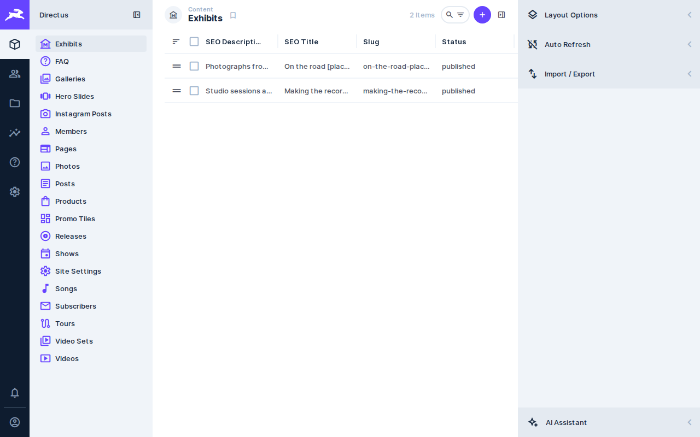

*The sidebar. Click a group (Tour, News, Band…) to open it.*

| Website page | Sidebar entry |
| --- | --- |
| Tour dates | **Tour → Tour dates** |
| Tour names (e.g. "Kerala Tour 2026") | **Tour → Tour names** |
| News, Press, Features, fan stories | **News → News & stories** |
| Band members | **Band → Band members** |
| Releases, Songs & lyrics | **Music → Releases**, **Music → Songs & lyrics** |
| The music player in the corner of the site | **Music → Tracks (audio for the site player)** |
| Videos | **Media → Video collections**, **Media → Videos** |
| Photos | **Media → Photo albums**, **Media → Photos** |
| Homepage banner | **Homepage → Homepage banner** |
| Band page photo (the big photo at the top of the Band page) | **Settings → Site settings → Band photo (top of the Band page)** |
| Homepage tiles | **Homepage → Homepage tiles** (the "New merch" and "Latest release" tiles: leave Picture and Link empty to auto-show the newest merch / latest release, or fill them in to override) |
| Help, Terms, Privacy, Fans pages | **Fans → Pages** |
| Newsletter sign-ups | **Fans → Newsletter sign-ups** |
| FAQ / the chatbot's answers | **Fans → FAQ & chatbot answers** |
| Shop | **Shop → Merch (auto-synced)** |
| Band name, tagline, social links, chatbot | **Settings → Site settings** |

## 2. Logging in

1. Go to https://masalacoffee.in/cms/admin/.
2. Type your email and password, then click the blue **Sign In** button.

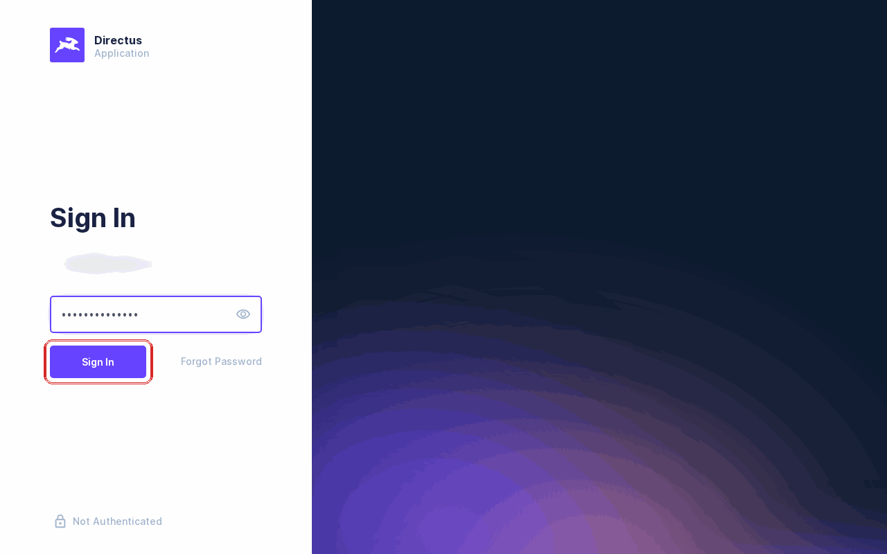

*Type your email and password, then click **Sign In**. Shyam will give you
your login.*

- **Forgot your password?** Click **Forgot Password** on this screen.
- **Want to change your password?** Click the person icon at the very bottom
  of the dark strip on the left.

## 3. Golden rules

> **Remember:** nothing is saved until you click the blue tick.

- **Save with the blue tick (✓) at the top right.** If you leave the page
  without clicking it, your work is gone.
- **Published means everyone can see it. Draft means only you can.**
  Use Draft while you are still writing.
- **Do not delete. Set it to Draft instead.** Deleting cannot be undone;
  Draft can.
- **Give the website a minute.** Changes show up within a minute. The chatbot
  can take up to five.
- **Ask before you change Site settings.** That one screen affects every page.

---

## 4. Everyday situations

<div class="situation situation--peach" markdown="1">

### 🎤 I want to add a show we just announced

**When to use this:** the band has confirmed a new concert and you want it on
the Tour page and the homepage.

**You will need:** the date, the city, the venue name, the ticket link, and
the poster picture saved on your computer or phone.

**Our example:** Kochi, Kerala, India · Saturday 14 February 2027 ·
Bolgatty Palace Lawns · tickets on BookMyShow.

1. In the sidebar, open **Tour** and click **Tour dates**.

   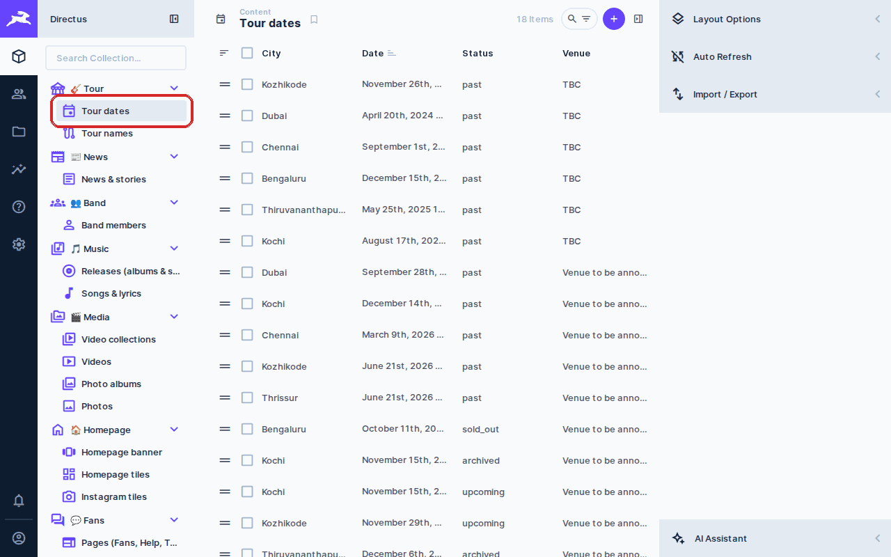

   *Click **Tour dates** in the left-hand list.*

2. Click the **blue + button** at the top right.

   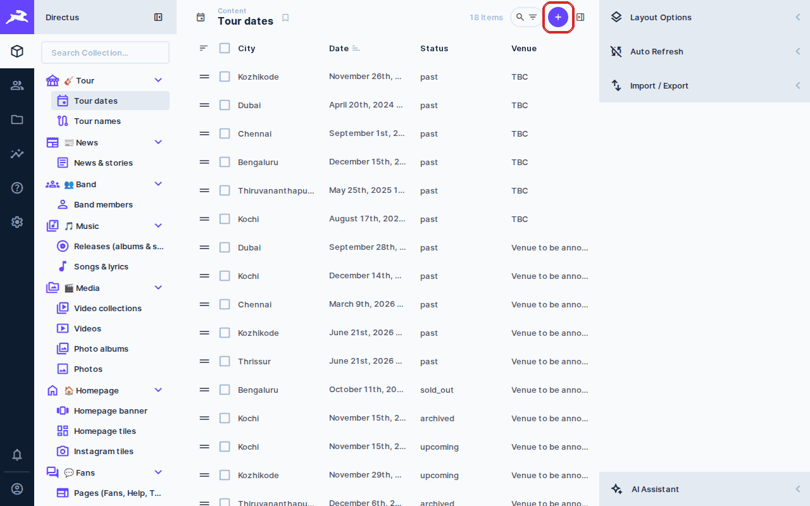

   *Click the blue **+** button. A blank show opens.*

3. Type the **City**, **State** and **Country**.

   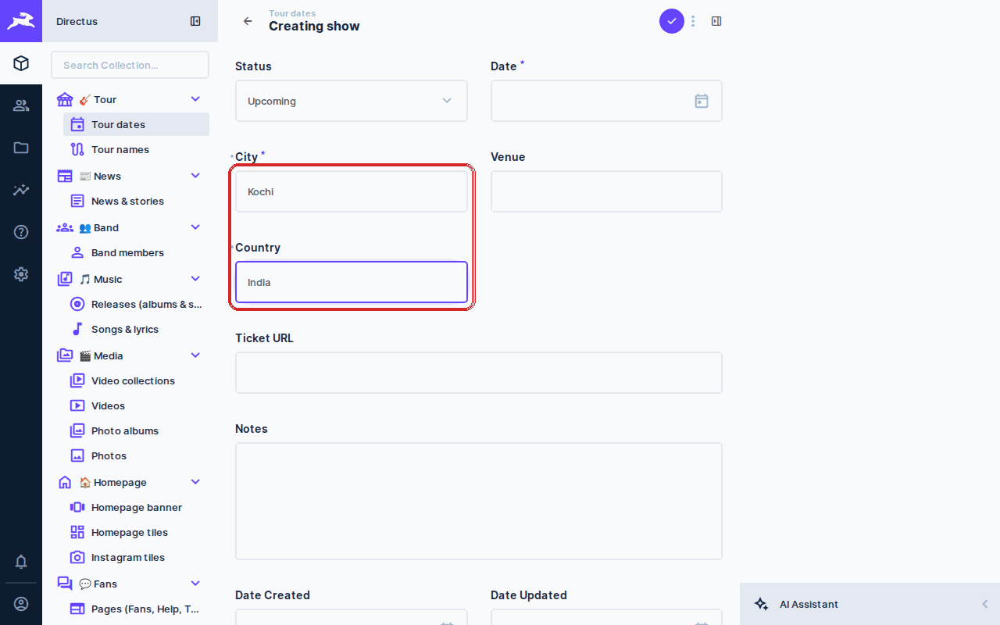

   *City: `Kochi`. State: `Kerala`. Country: `India`.*

4. Click the **Date** box, move to the right month with the arrows, and click
   the day.

   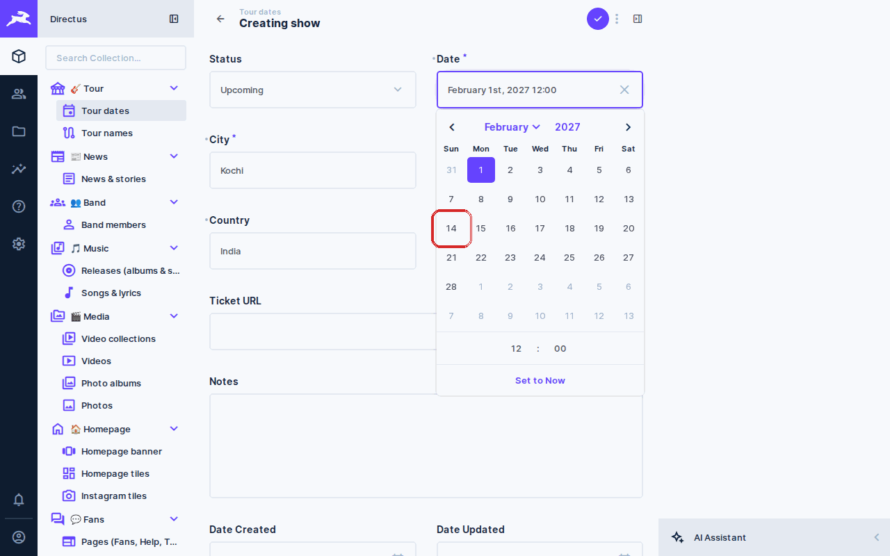

   *Pick **14** in **February 2027**. The time below the calendar is the show
   time — change it if you know it.*

5. Type the **Venue**.

   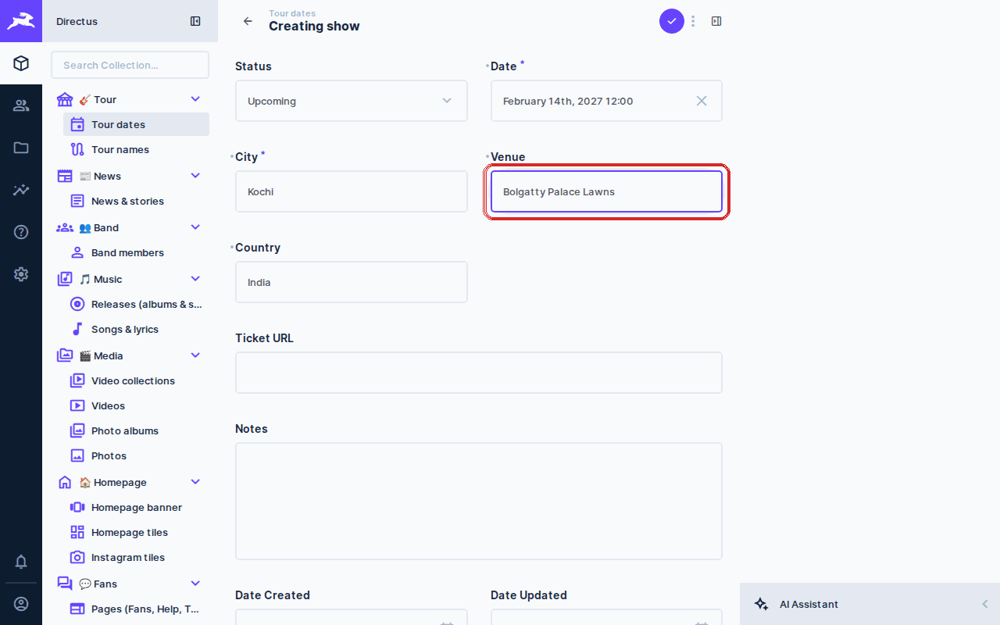

   *Venue: `Bolgatty Palace Lawns`. If the venue is not announced yet, leave
   it as "Venue to be announced".*

6. Paste the **Ticket URL**.

   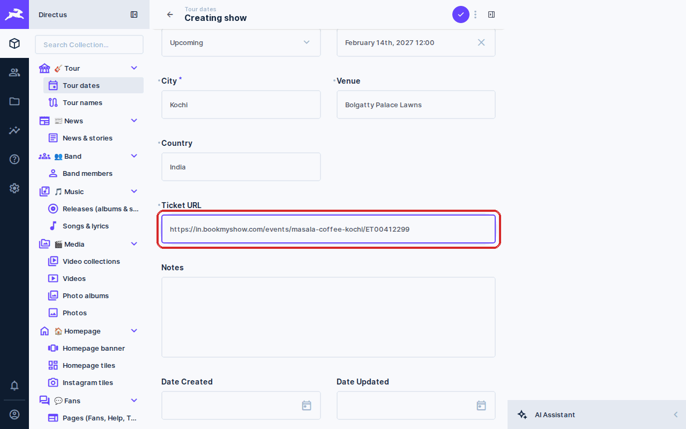

   *Paste the whole BookMyShow (or other) link. Leave it empty if tickets are
   not on sale yet.*

   > The **Web address** field above the ticket URL fills itself in
   > automatically from the date, city and state as soon as you save — you
   > never need to type it. Leave it alone.

7. Click the **upload arrow** in the Poster picture box.

   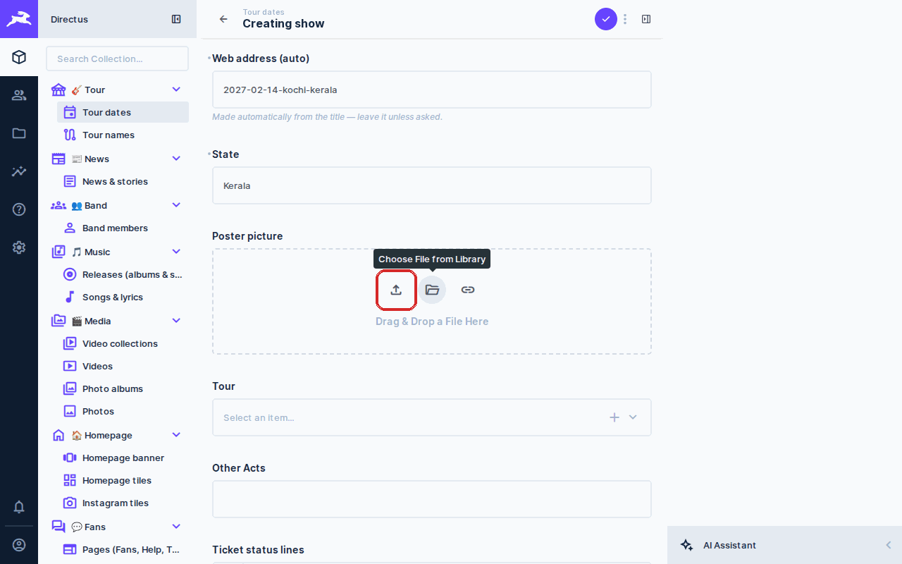

   *Click the **↑** button, then pick the poster from your computer or phone.
   You can also drag the picture straight into the dotted box.*

8. Check the poster looks right.

   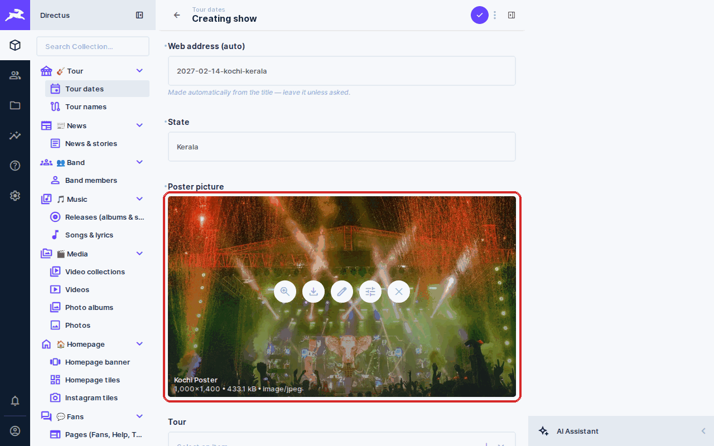

   *The poster now shows in the box. A tall (portrait) picture works best here.*

9. Fill in **Ticket status lines** — the small rows shown on the show card.

    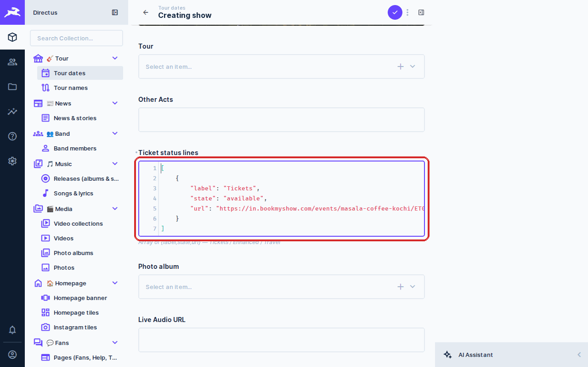

    *Copy this exactly and change the link:*

    ```json
    [
      { "label": "Tickets", "state": "available", "url": "https://..." }
    ]
    ```

    *`"state"` can be `available` (green "On sale"), `unavailable`
    ("Sold out") or `info`. Leave the box empty if you are not sure — the show
    still works.*

10. Click the **blue tick (✓)** at the top right to save.

    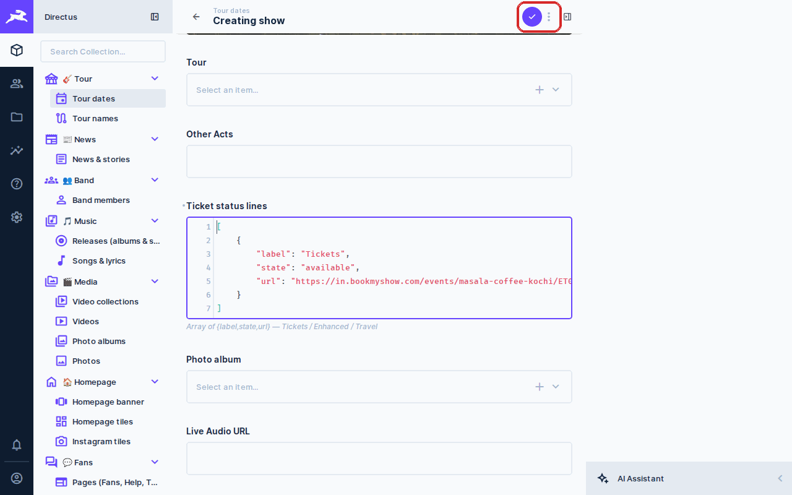

    *This is **Save**. Nothing is kept until you click it.*

#### What it looks like on the site

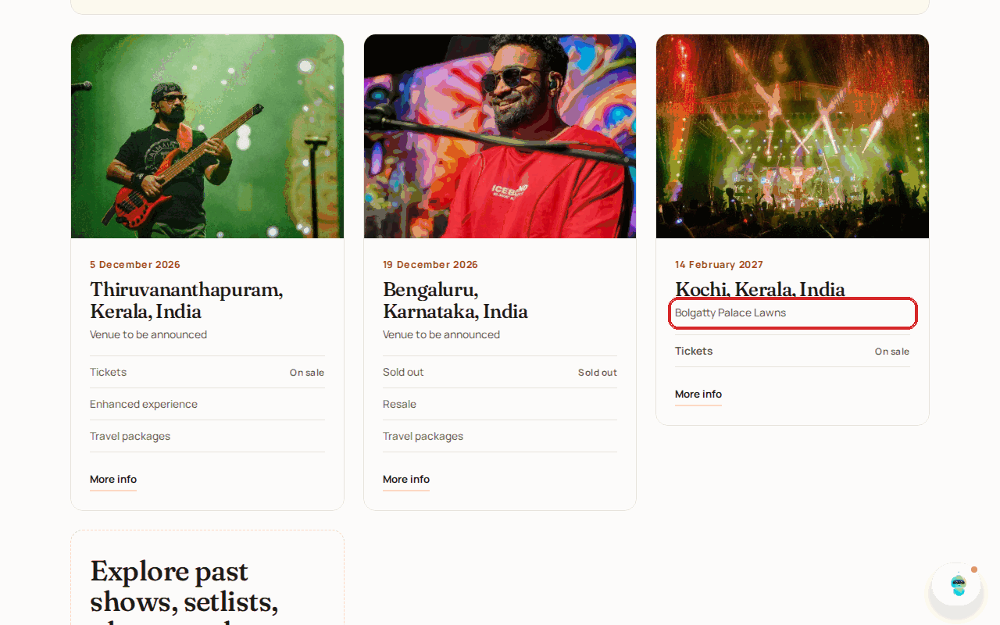

*The Tour page now lists the show, with the poster, the date and the
"On sale" tag.*

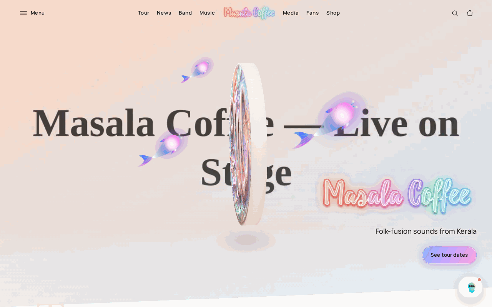

*It also appears in the tour list on the homepage.*

#### Common mistakes

- Leaving **Status** on something other than `Upcoming`.
- Using a wide photo as the poster — posters look best tall.

> **Done ✅ — check it on the website at `/tour/`.**

</div>

<div class="situation situation--sky" markdown="1">

### 🎫 Tickets sold out, or the show is over

**When to use this:** tickets have gone, the show was cancelled, or the show
has already happened.

**You will need:** nothing. This is one field.

1. Open **Tour → Tour dates**, click the show, and change **Status**.

   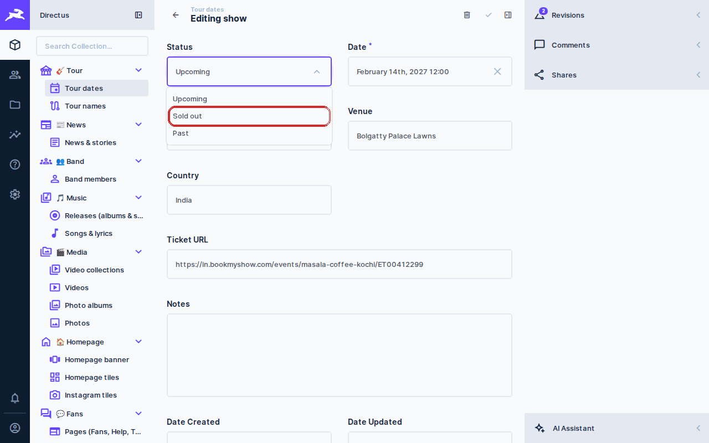

   *Click the **Status** box and pick one:*

   | Pick this | What happens on the website |
   | --- | --- |
   | **Sold out** | A "Sold out" tag shows; the ticket button stops working |
   | **Past** | The show leaves the Tour page and joins `/tour/past/` |
   | **Upcoming** | Back to normal, tickets on sale |

   *Then change **Ticket status lines** to match, for example:*

   ```json
   [
     { "label": "Sold out", "state": "unavailable" }
   ]
   ```

   *Click the blue tick (✓) to save.*

#### What it looks like on the site

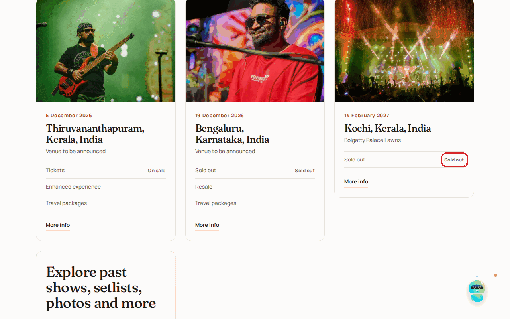

*The card now says **Sold out** instead of **On sale**.*

#### Common mistakes

- Changing **Status** but leaving the old "Tickets — On sale" line in
  **Ticket status lines**. The card then says two different things.
- Deleting a finished show. Use **Past** — the archive and the setlists need it.

> **Done ✅ — check it on the website at `/tour/`.**

</div>

<div class="situation situation--gold" markdown="1">

### 📸 I want to put up photos from last night

**When to use this:** you have pictures from a show and want a photo album on
the site, linked to that show.

**You will need:** the pictures on your computer, the album name, and the
show's web address (it filled itself in automatically when you saved the
show recipe above — open the show and copy it from the **Web address** box).

**Our example:** an album called "Live in Kochi, Feb 2027" with five pictures.

1. Open **Media → Photo albums** and click the **blue + button**.

   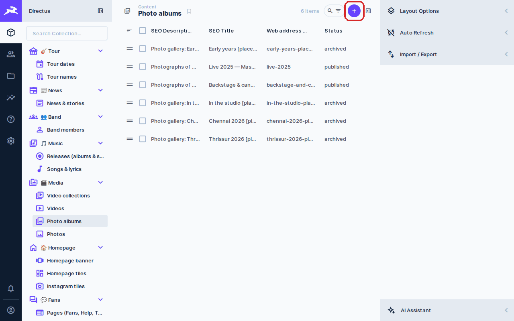

   *Click the blue **+** button.*

2. Type the album **Title**.

   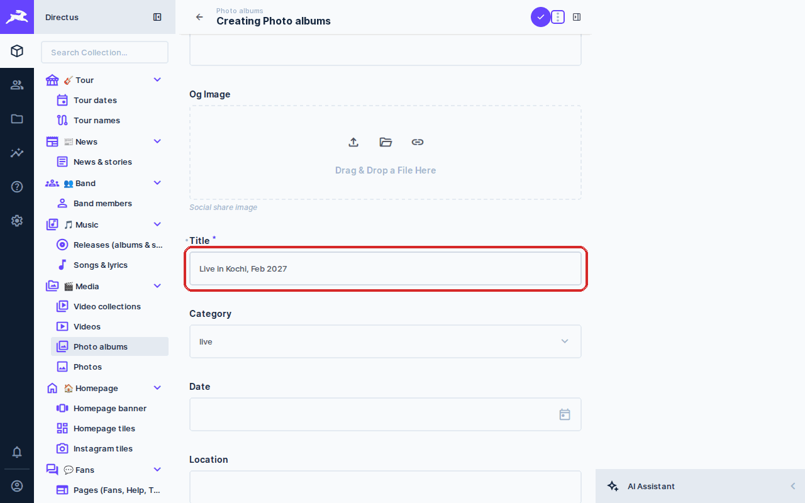

   *Title: `Live in Kochi, Feb 2027`. Then fill in **Category** (`Live`),
   **Date** and **Location** the same way as before.*

3. Pick a **Cover** picture — the one that shows on the Photos page.

   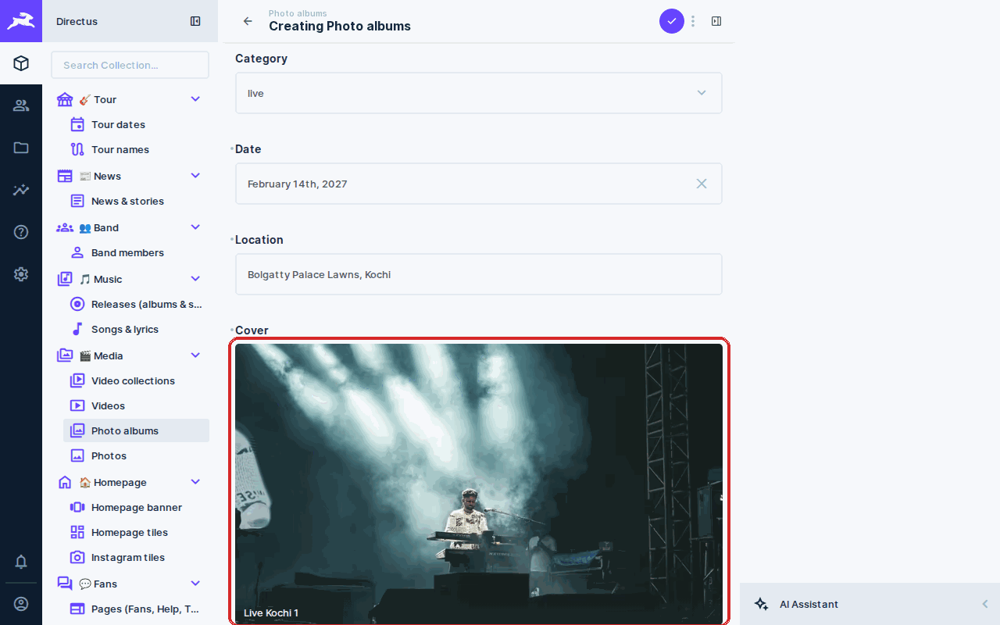

   *Click the Cover box. The **File Library** opens. Click your picture, then
   the tick at the top right of the library.*

4. Type the show's web address into **Show Slug**.

   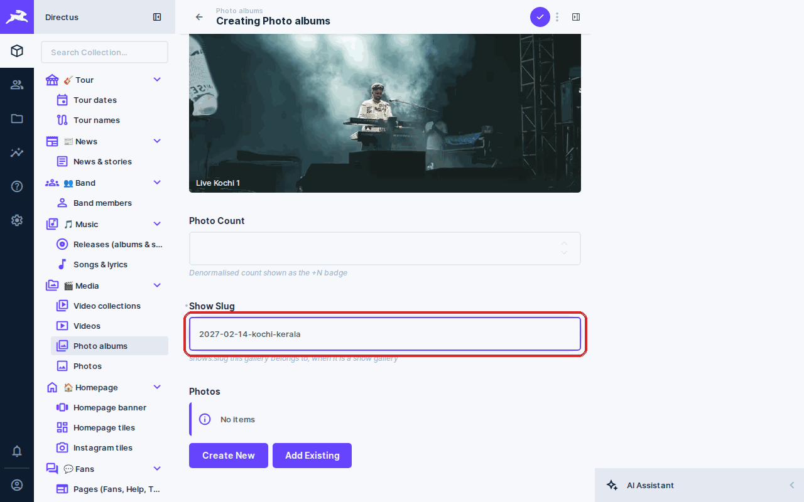

   *`2027-02-14-kochi-kerala` — exactly what filled itself in on the show's
   own **Web address** box in the show recipe above. This is what links the
   album to the show.*

5. Scroll to **Photos** and click **Create New** — once for each picture.

   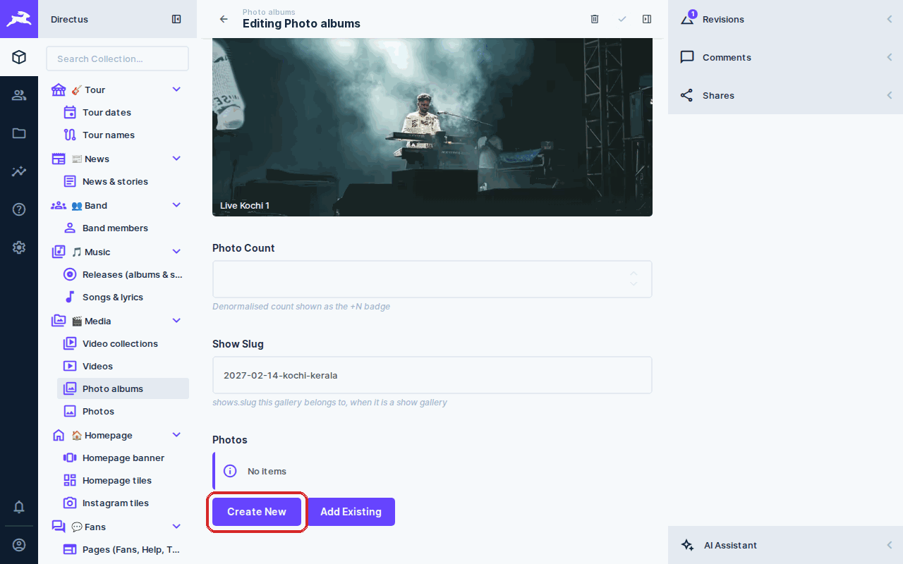

   *Click **Create New**, drag one picture in, add a caption, save it, and
   repeat. You can drag the rows afterwards to change the order.*

6. Check all your pictures are listed.

   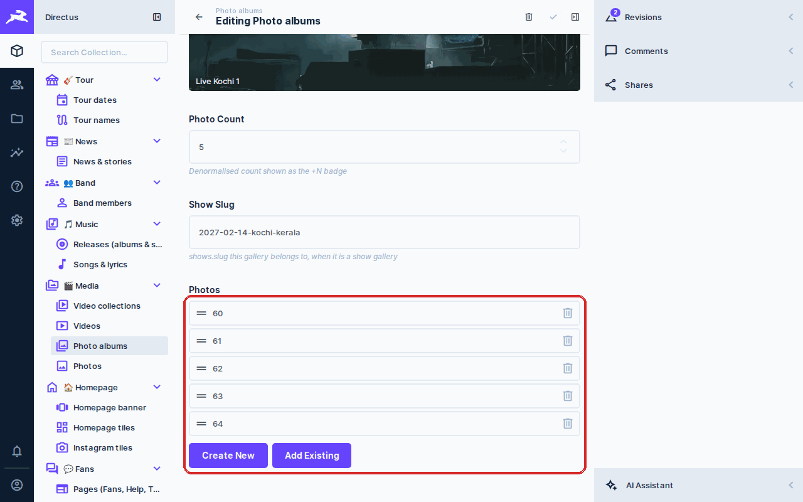

   *Five pictures, in order. Set **Status** to `Published` and click the blue
   tick (✓).*

#### What it looks like on the site

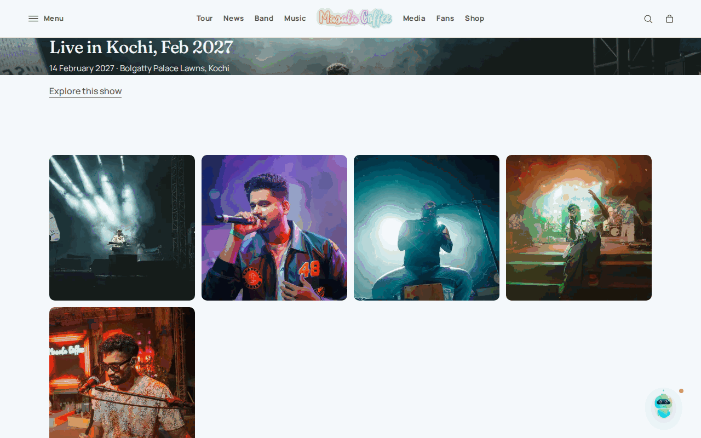

*The album page at `/photos/live/live-in-kochi-feb-2027/`.*

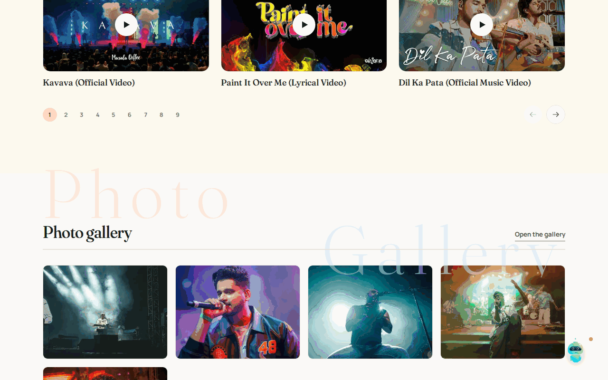

*Because you filled in **Show Slug**, the pictures also appear on the show's
own page.*

#### Common mistakes

- Forgetting **Status → Published**. A draft album is invisible.
- A typo in **Show Slug** — the photo strip then does not appear on the show.
- Uploading huge phone photos. See [Picture tips](#5-picture-tips).

> **Done ✅ — check it on the website at `/photos/`.**

</div>

<div class="situation situation--lavender" markdown="1">

### 🎵 We released a new song

**When to use this:** a new single, EP or album is out on Spotify and Apple
Music and you want it on the Music page.

**You will need:** the song title, who wrote it, the release date, the cover
art, and the Spotify and Apple links.

**Our example:** a single called "Kochi Kaattu", out 10 February 2027.

1. First add the **song**. Open **Music → Songs & lyrics**, click the blue
   **+**, and fill in the title and who wrote it.

   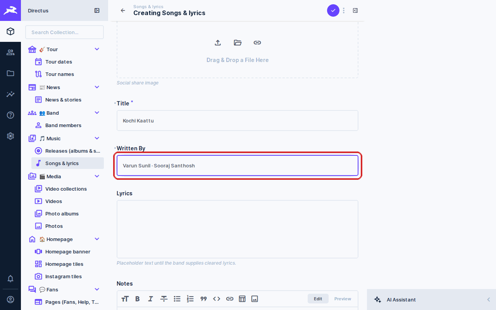

   *Title, web address and **Written by**. Set **Status** to `Published` and
   save with the blue tick.*

2. Now add the **release**. Open **Music → Releases**, click the blue **+**,
   and fill in the type, category and date.

   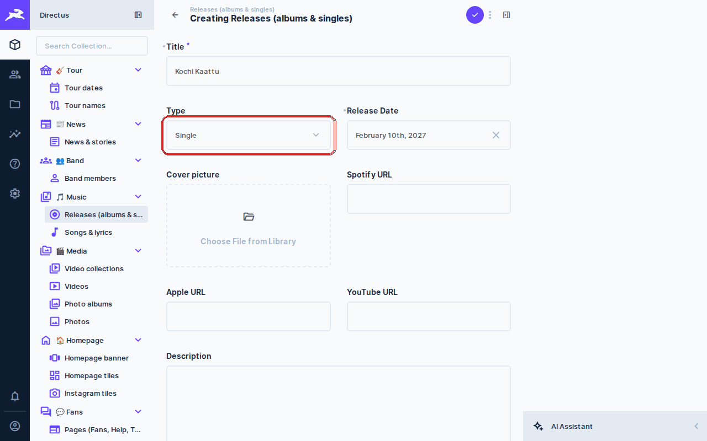

   *Type: `Single`. Category: `Singles`. Release date: `10 February 2027`.*

3. Pick the **Cover picture**.

   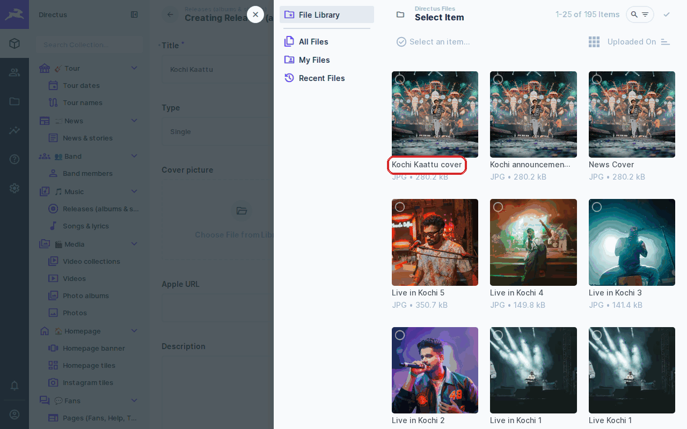

   *Click the Cover box, pick the picture in the File Library, then click the
   tick at the top right of the library.*

   > **Tip:** no artwork to hand? A YouTube video's picture works well. Open
   > `https://img.youtube.com/vi/<video ID>/maxresdefault.jpg` in your browser
   > (see the next recipe for where to find the video ID), right-click, and
   > save the picture.

4. Paste the streaming links.

   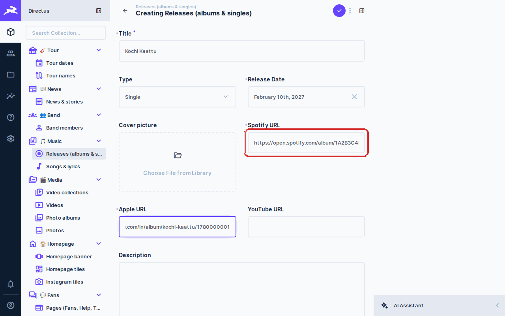

   *Paste the whole Spotify link into **Spotify URL**, the Apple Music link
   into **Apple URL**. Set **Status** to `Published` and save.*

5. Attach the song. Scroll to **Tracks**, click **Add Existing**, and click
   your song in the list.

   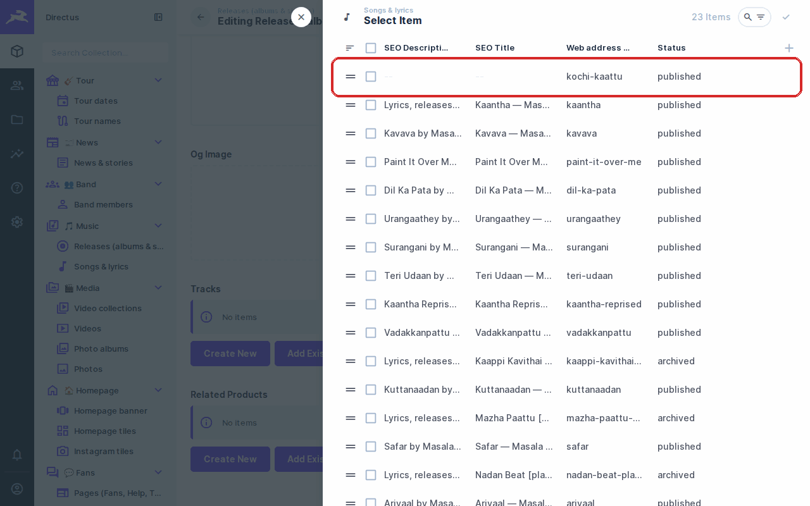

   *Click the row, then the tick at the top right. Drag the rows to set the
   track order. Save with the blue tick.*

#### What it looks like on the site

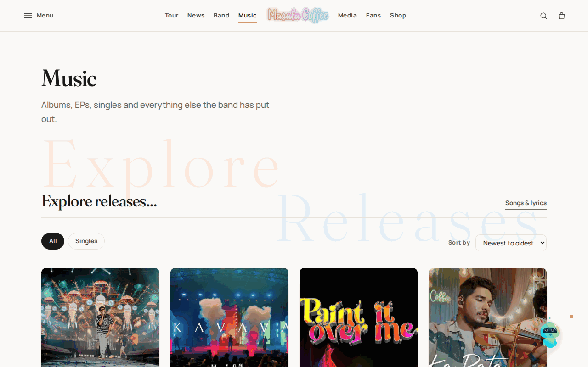

*The release now appears on the Music page, with its cover and date.*

#### Common mistakes

- Adding the release but forgetting the song, so the album page has no
  tracklist.
- Putting the release in the wrong **Category** — it decides which shelf of
  the Music page it sits on.

> **Done ✅ — check it on the website at `/releases/`.**

</div>

<div class="situation situation--gold" markdown="1">

### 🎧 I want to add a song to the site's music player

**When to use this:** you want a song to play in the slim music bar that sits
down the left-hand edge of the website and keeps playing while people click
around.

**You will need:** the audio file on your computer — an **MP3** or **M4A** — and
the right to put it online (see the warning below).

**Our example:** a live recording called "Kaantha (Live at Kochi)".

> ⚠️ **Only upload music the band owns.** Anything you put here plays to the
> whole internet, and the file itself can be downloaded. If a song is tied up
> in a label or publisher deal, **ask first** — or upload a 60-second preview
> instead of the whole track. When in doubt, don't.

1. Open **🎵 Music → Tracks (audio for the site player)** in the left-hand menu.
   This is the list of everything the player can play.

   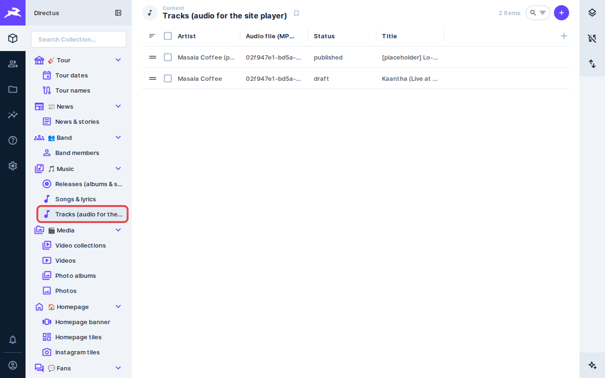

   *You will see the band's ten songs, in the order they play, plus one greyed-out
   row called "[placeholder] Lo-fi demo loop" — that is the old stand-in tune,
   kept but switched off.*

2. Click the blue **+** at the top right. Fill in the **Title** (and the
   **Artist**, if it is not just "Masala Coffee"), then click the
   **Audio file** box and choose your MP3 from your computer.

   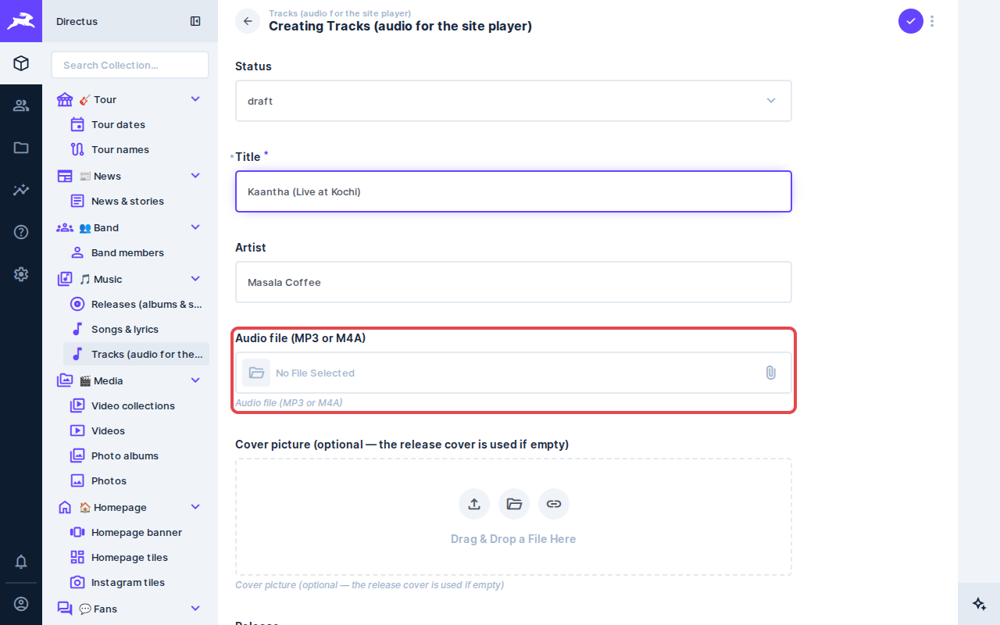

   *Only the **Title** and the **Audio file** are required. **Cover picture** is
   optional — if you leave it empty and pick a **Release**, the player borrows
   that release's cover.*

3. Set **Status** to `Published`, then save with the blue tick at the top right.

   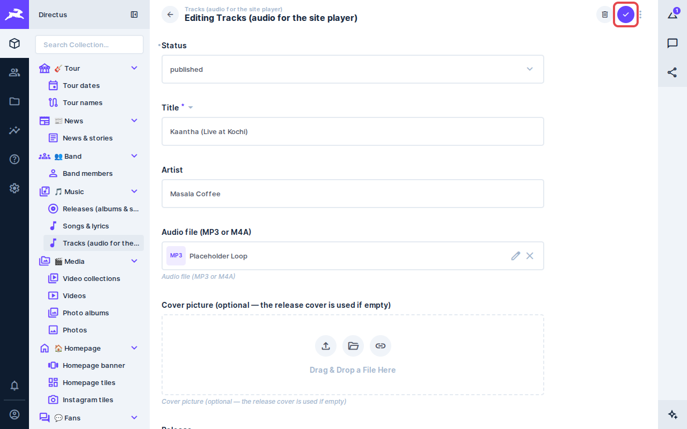

   *Nothing appears on the website until the status is `Published` and you have
   pressed the tick.*

4. That's it — the song joins the ten already there.

   > **Tip:** the order of the list is the order it plays in. Drag the rows in
   > the **Tracks** list to change it. Today they run in order of how popular
   > each song is (Kaantha Njaanum Varaam first, then Munbe Vaa, then Aalayal
   > Thara Venam); if you would rather lead with a new single, just drag it to
   > the top.

   > **A note on how loud it is.** The ten songs already on the site were all
   > levelled to the same loudness, so none of them jumps out. A song you upload
   > yourself has not been through that, so it may sound noticeably louder or
   > quieter than the rest. If it does, ask whoever looks after the site to run
   > it through the same step.

#### What it looks like on the site

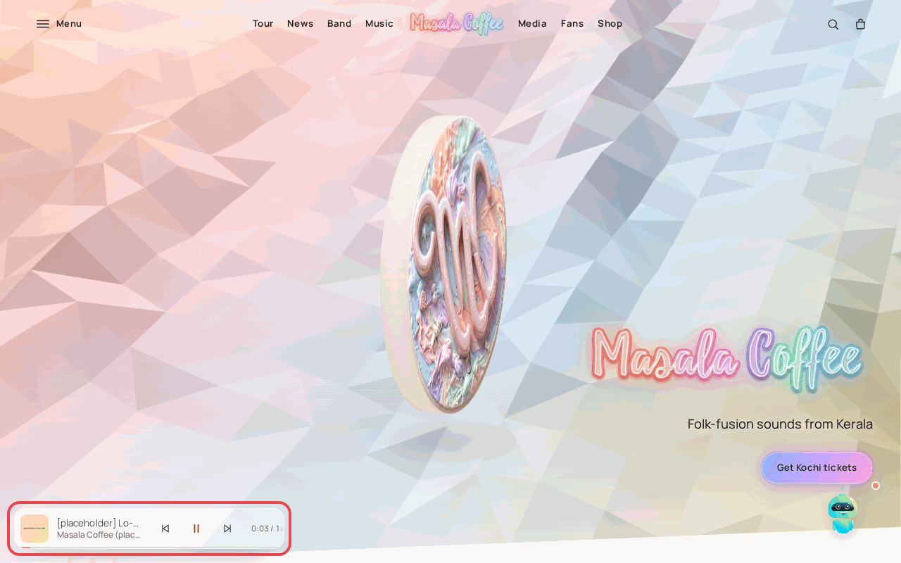

*It starts as a small circle against the left edge, halfway down, showing
nothing but a play button — click it and it starts playing right there,
without opening anything. Hover (or, on a phone, tap the little arrow next to
it) to open the full bar: cover, back / play / next, the progress line and the
time; hovering it also slides out the song's name. It stays playing as
visitors move from page to page, and closes itself back down to the circle a
few seconds after they stop interacting with it, or if they press Escape. On a
phone it sits against the **right** edge instead, so it stays clear of the
band's name.*

*The coloured rings drifting behind the homepage follow the beat of whatever
is playing — automatically, a few minutes after you upload a song. There is
nothing to set up and nothing to fill in.*

#### Common mistakes

- Leaving **Status** on `Draft`, so the song never reaches the site.
- Uploading a video file or a WAV. It must be an **MP3** or **M4A**, or the
  player cannot play it.
- Uploading a very long, very large file. Keep it under about 10 MB so it
  starts quickly on a phone — the songs already on the site are 4–7 MB each.
- Re-publishing the old "[placeholder] Lo-fi demo loop" row by accident. Leave
  it on `Draft`.

> **Done ✅ — check it on the website: press play in the bar on the left edge.**

</div>

<div class="situation situation--mint" markdown="1">

### 🎬 We put a new video on YouTube

**When to use this:** a new video is live on YouTube and you want it on the
Videos page.

**You will need:** the YouTube link, and to know which collection it belongs
in (music videos, live sessions, or behind the scenes).

1. Find the **video ID** in the YouTube address.

   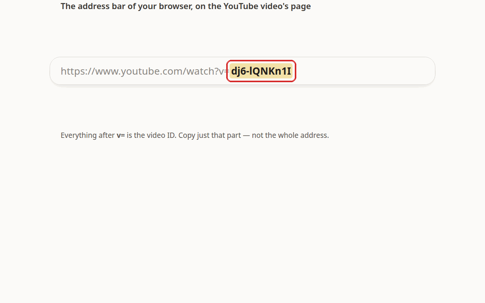

   *In `youtube.com/watch?v=dj6-lQNKn1I` the ID is everything after **v=** —
   here `dj6-lQNKn1I`. On a short link like `youtu.be/dj6-lQNKn1I` it is the
   part after the last slash. It is always 11 characters.*

2. Open **Media → Videos**, click the blue **+**, and paste just the ID into
   **YouTube video ID**.

   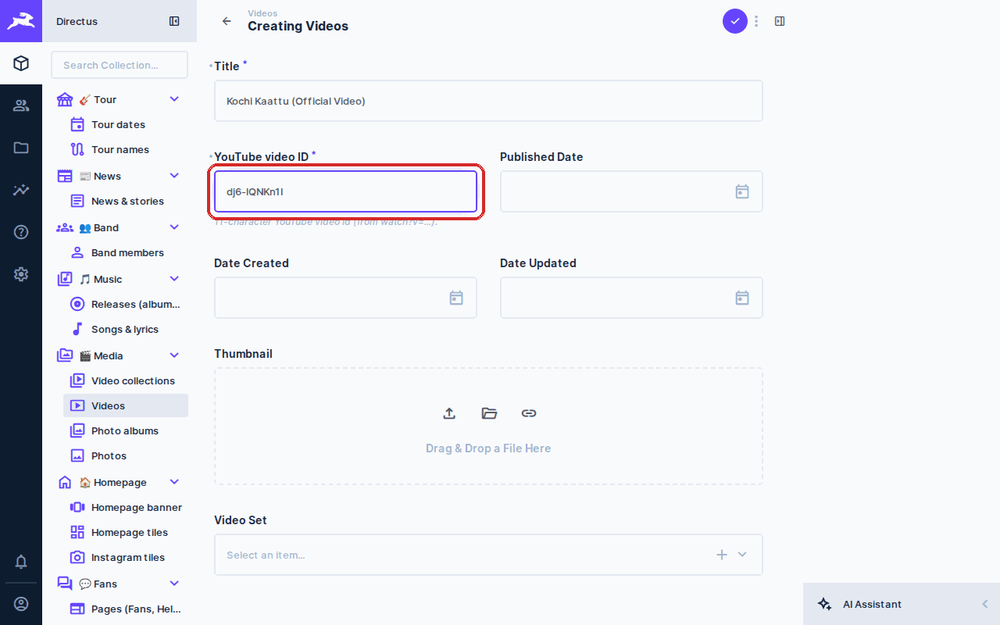

   *Paste **only** the ID — not the whole address. Add a **Title** too.*

3. Choose the **Video set** the video belongs to.

   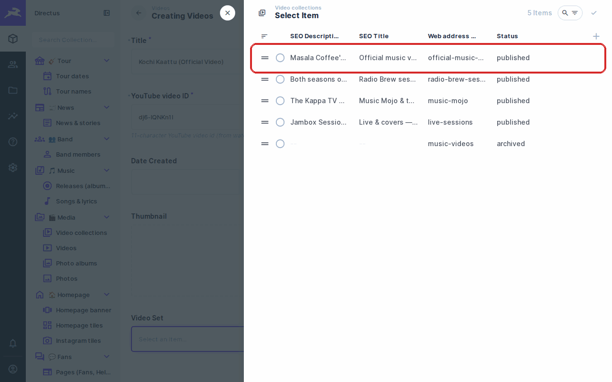

   *Click the row for the collection you want, then the tick at the top right
   of the picker. Save with the blue tick.*

#### What it looks like on the site

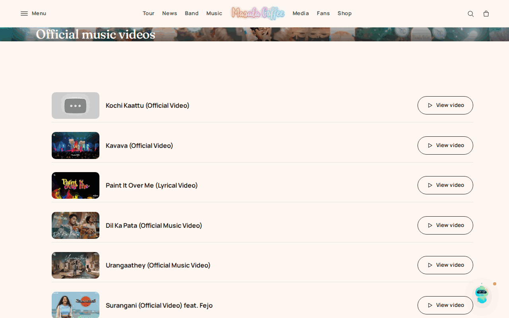

*The video appears in that collection on the Videos page.*

#### Common mistakes

- Pasting the whole `https://www.youtube.com/watch?v=…` address instead of
  just the ID. The video then shows as a grey box.
- Forgetting the **Video set** — the video exists but is on no page.

> **Done ✅ — check it on the website at `/videos/`.**

</div>

<div class="situation situation--peach" markdown="1">

### 📰 I want to tell fans something

**When to use this:** an announcement, an interview, a thank-you — anything
that belongs on the News page.

**You will need:** a headline, a picture, a couple of sentences, and the text
of the post.

**Our example:** "See you in Kochi in February".

1. Open **News → News & stories**, click the blue **+**, and type the
   **Title**.

   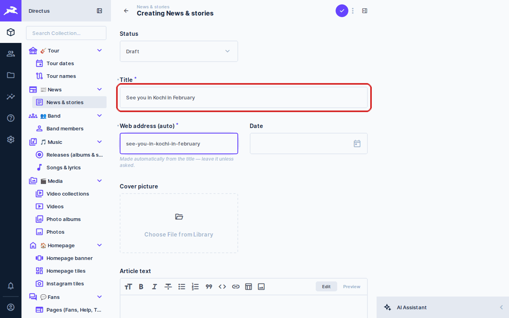

   *The **Web address** below fills itself in from the title. Leave it alone.*

2. Pick a **Cover picture**.

   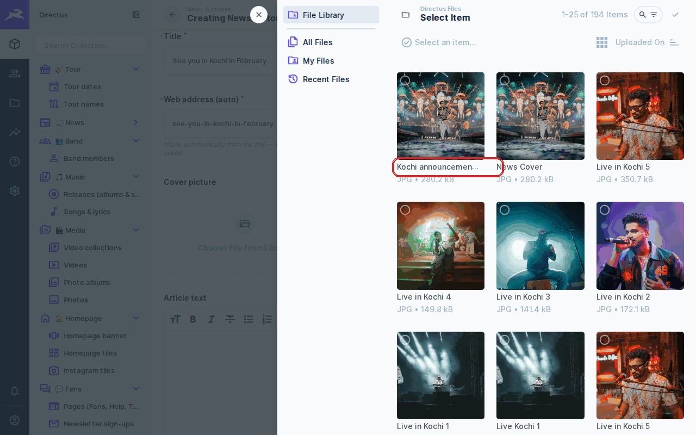

   *Click the Cover box, pick your picture in the File Library, then click the
   tick at the top right of the library. Set the **Date** and the
   **Category** (`News`) too, and write a **Short summary** — the one or two
   lines shown in the news list.*

3. Write the post in **Article text**.

   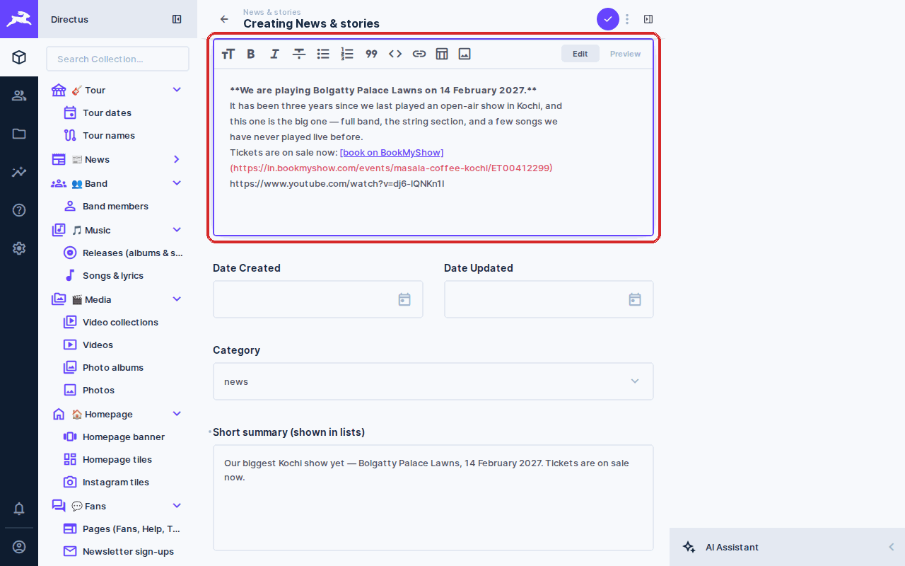

   *Plain typing works. For the extras:*

   | To get this | Type this |
   | --- | --- |
   | **Bold line** | `**your words**` |
   | A link | `[the words people click](https://example.com)` |
   | A heading | `## Your heading` |
   | A YouTube video | the plain YouTube link, alone on its own line |

4. Leave **Status** on **Draft** while you write, and save.

   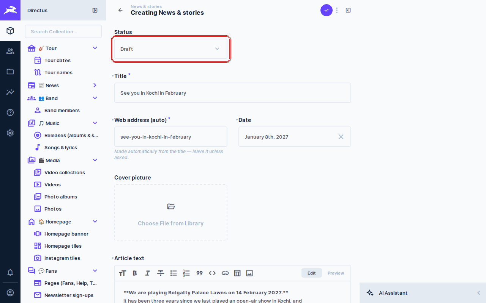

   *Draft means only you can see it. Save with the blue tick, go away, come
   back, read it again.*

5. When you are happy, change **Status** to **Published** and save again.

   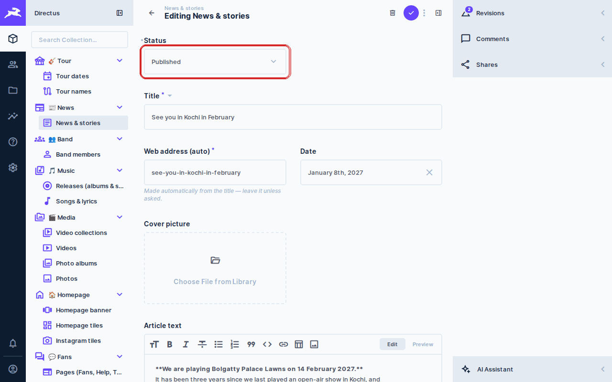

   *Now everybody can see it.*

#### What it looks like on the site

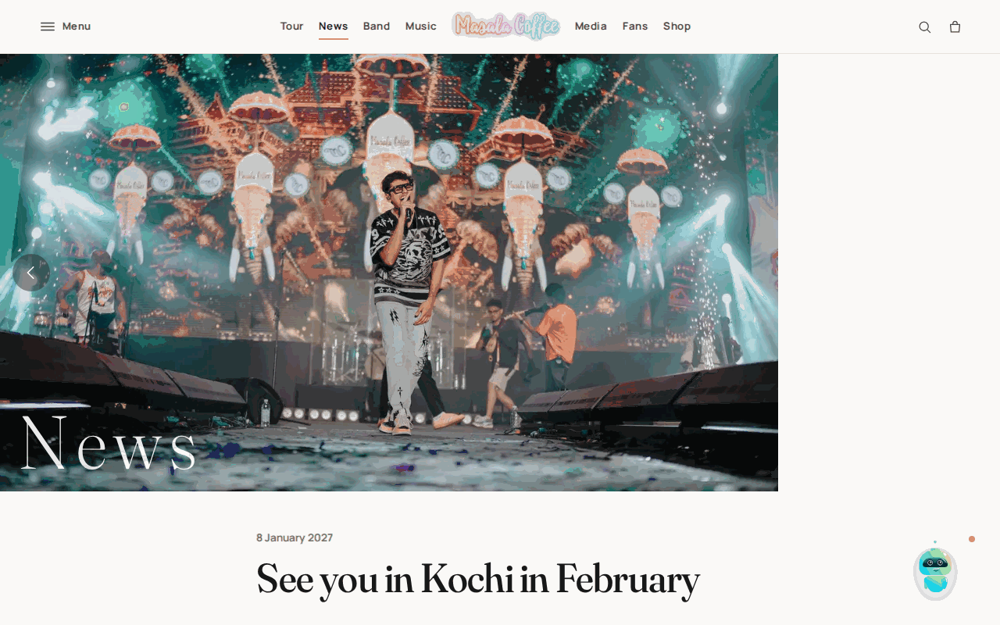

*The article, with its cover picture, at `/news/see-you-in-kochi-in-february/`.*

#### Common mistakes

- Leaving it on **Draft** and wondering why nobody can see it.
- Pasting a YouTube link in the middle of a sentence — it only turns into a
  video when it is alone on its own line.

> **Done ✅ — check it on the website at `/news/`.**

</div>

<div class="situation situation--sky" markdown="1">

### 🏠 I want to change the big banner on the homepage

**When to use this:** the big pictures at the top of the homepage need
changing, or the button under them needs to point somewhere new.

**You will need:** a wide photo for each banner, the button words, and where
the button should link to.

The top of the homepage is now a **slideshow of your own photographs**, one
banner each, with the Masala Coffee logo and a button over the bottom corner.
Every banner needs a **landscape photo** — 2400 × 1350 or larger, JPG — and
the band's name, `Masala Coffee`, as its **Title**, which is what puts the
glowing logo on it. (Type anything else in Title and that text is shown
instead of the logo.) Three or four banners is a good number; more than about
five and visitors never see the last ones.

1. Open **Homepage → Homepage banner**, click the banner you want, and change
   **Button text** and **Button link**.

   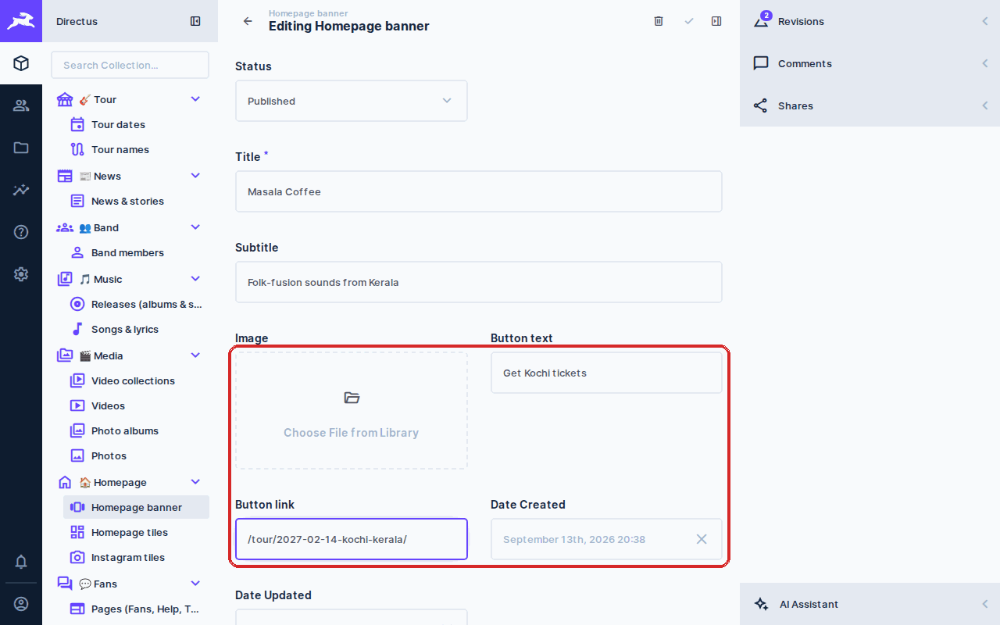

   *Button text: `Get Kochi tickets`. Button link: `/tour/2027-02-14-kochi-kerala/`.
   Leave both empty if you want no button at all. Save with the blue tick.*

2. To add a **second** banner, go back and click the blue **+**, then pick an
   **Image**.

   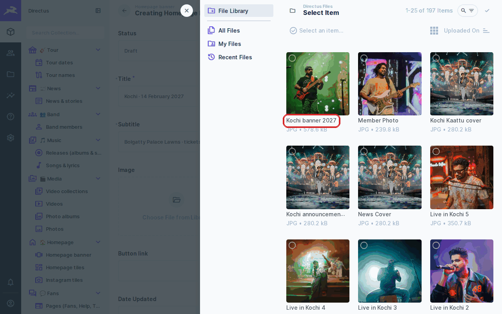

   *Click the Image box, pick a wide picture in the File Library, then the
   tick at the top right. The picture must be wider than it is tall —
   2400 × 1350 or larger is ideal, and it is shown across the whole screen,
   so use the good, big version of the photo rather than a small copy. Set
   **Title** to `Masala Coffee` so the logo goes on it, and write one short
   line in **Subtitle** — "Live across India", say.*

3. Set **Status** to **Published** so it actually shows.

   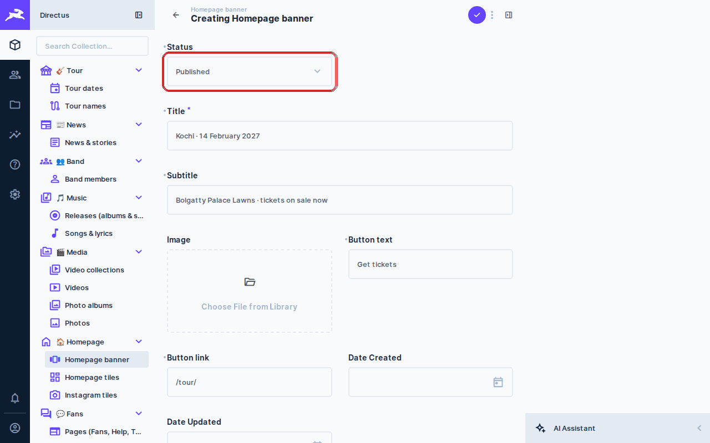

   *`Draft` prepares a banner for later. `Archived` retires an old one
   without deleting it. Save with the blue tick.*

4. To change the **order**, drag the banners in the list.

   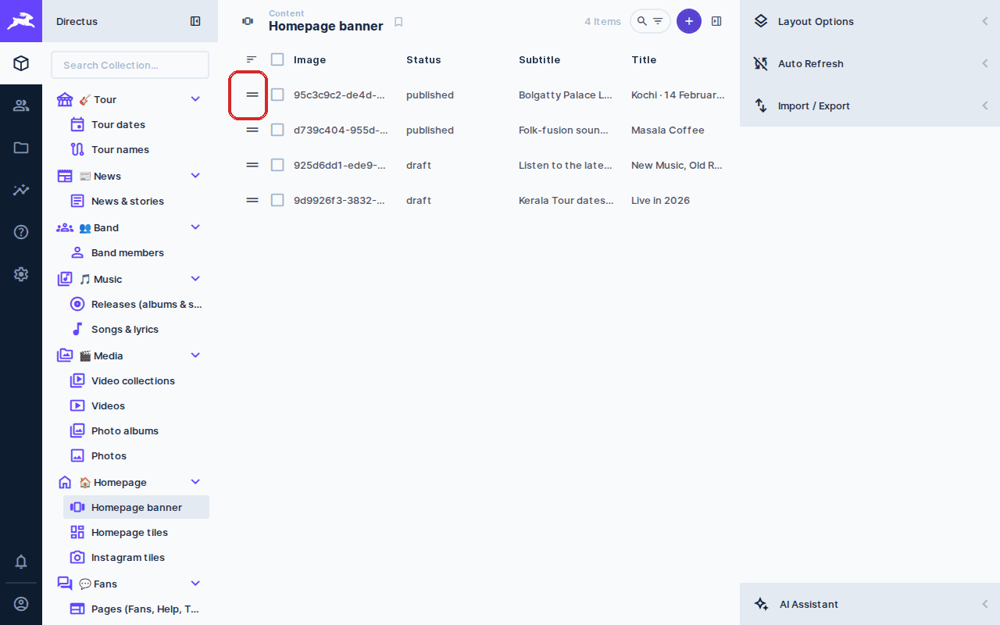

   *Grab the **≡** handle on the left of a row and drag it up or down. The top
   one shows first — it is the picture everybody sees, so put the best one
   there.*

   (**Homepage main photo** in **Settings → Site settings** is left over from
   the old homepage and is no longer shown anywhere. Ignore it.)

   The **Band photo** at the top of the Band page is a separate picture, set
   in **Settings → Site settings → Band photo (top of the Band page)**. It
   works best as a photo with a plain, flat-colour background, because the
   strip around the picture is painted to match — for the current photo that
   is a shade of yellow picked to match its own backdrop. Swapping in a photo
   with a different-coloured background needs a small code change too (ask
   the developer) so the strip still matches; swapping in another photo with
   the *same* yellow backdrop needs no code change. The picture is always
   shown in full (never cropped), so a wide group photo works best. Leave it
   empty to hide that part of the page entirely.

#### What it looks like on the site

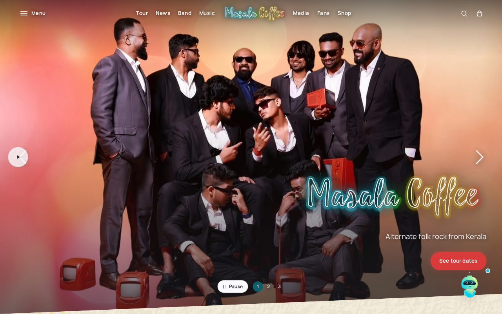

*The homepage, with the photo filling the screen and the logo and button over
it. Banners change by themselves every six seconds; the arrows, the numbered
buttons and the Pause button let visitors take over, and on a phone they can
swipe.*

#### Common mistakes

- A tall or square picture. It is shown across the whole screen, so the top
  and bottom get cropped away and faces get cut off.
- A small or blurry copy of a photo. Use the biggest version you have.
- A photo that is bright in the **bottom-right corner** — that is where the
  logo and the button sit. The site darkens that corner for you, but a photo
  that is busy there is still the hardest to read over.
- Forgetting the **Title**. Put `Masala Coffee` there for the logo.
- Leaving a banner on **Draft** and wondering why it never appears.
- A **Button link** with no leading slash. Use `/tour/`, not `tour/`.

> **Done ✅ — check it on the website at `/`.**

</div>

<div class="situation situation--lavender" markdown="1">

### 👤 A member changed, or the bio has a mistake

**When to use this:** somebody joined or left, a photo is out of date, or
there is a typo in the band description.

**You will need:** the new photo, and the correct words.

1. Open **Band → Band members**, click the person, and fix the **Role**.

   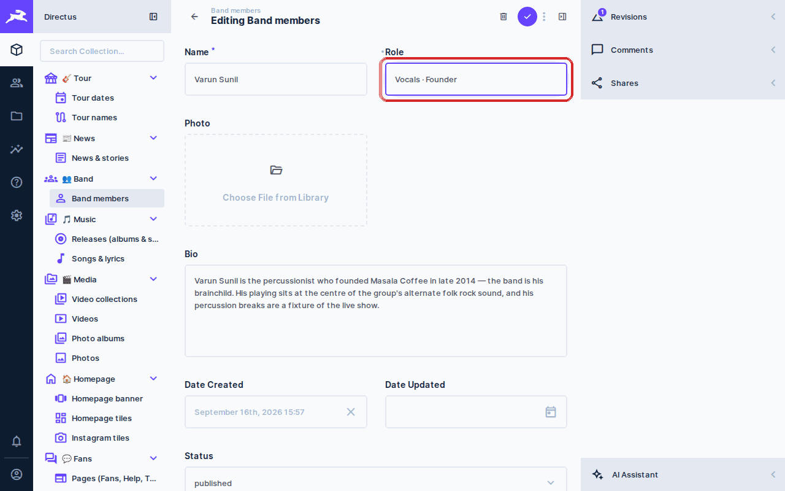

   *Write it the way it should read on the site, for example
   `Vocals · Founder`.*

2. Click the **Photo** box to change the picture.

   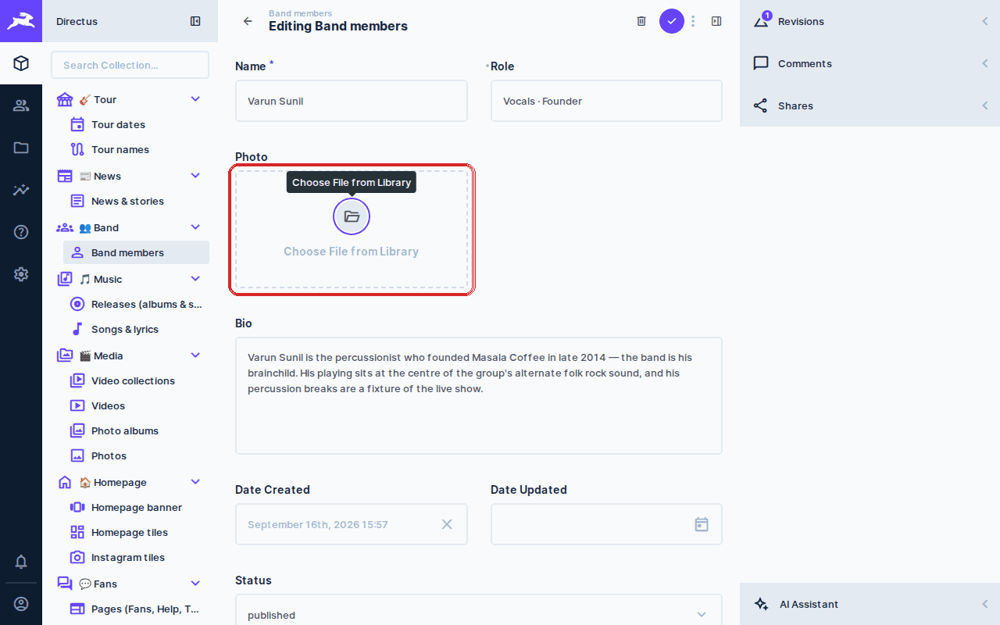

   *Click the box, pick the new picture in the File Library, then the tick at
   the top right. A square or portrait photo, centred on the face, works best.
   Save with the blue tick.*

3. For the band's own description, open **Settings → Site settings** and edit
   the **Tagline**.

   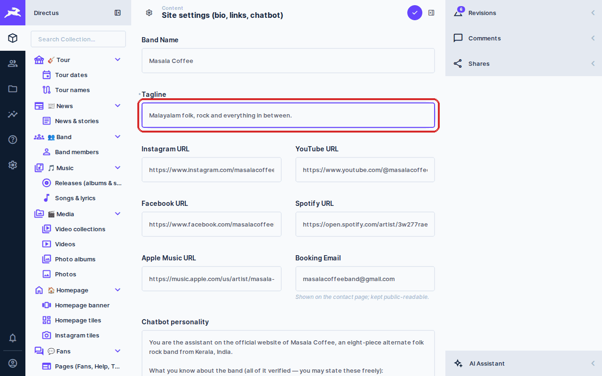

   *This line appears across the site and in the chatbot's introduction. Save
   with the blue tick.*

#### Common mistakes

- Deleting a member who has left. Set **Status** to `Draft` instead — their
  name still appears in old credits.
- Changing **Site settings** without telling the rest of the band. That screen
  affects every page.

> **Done ✅ — check it on the website at `/band/`.**

</div>

<div class="situation situation--mint" markdown="1">

### 🤖 The chatbot got something wrong

**When to use this:** a fan asked the chat bubble something and it said it did
not know, or got it wrong.

**You will need:** the question, in the words fans actually use, and the
correct answer.

The chatbot only knows what is in this admin panel. It never makes anything
up — if it does not know, it says so. So the fix is always the same: tell it.

1. Open **Fans → FAQ & chatbot answers**, click the blue **+**, and write the
   question and the answer.

   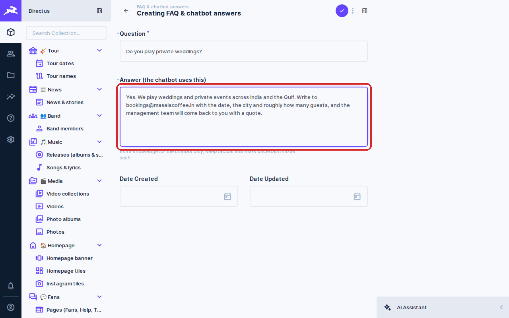

   *Write the answer in full sentences, as if you were replying to the fan.
   Include the details — email addresses, cities, prices. Save with the blue
   tick.*

2. Wait five minutes, then ask the chatbot the same question on the website.

   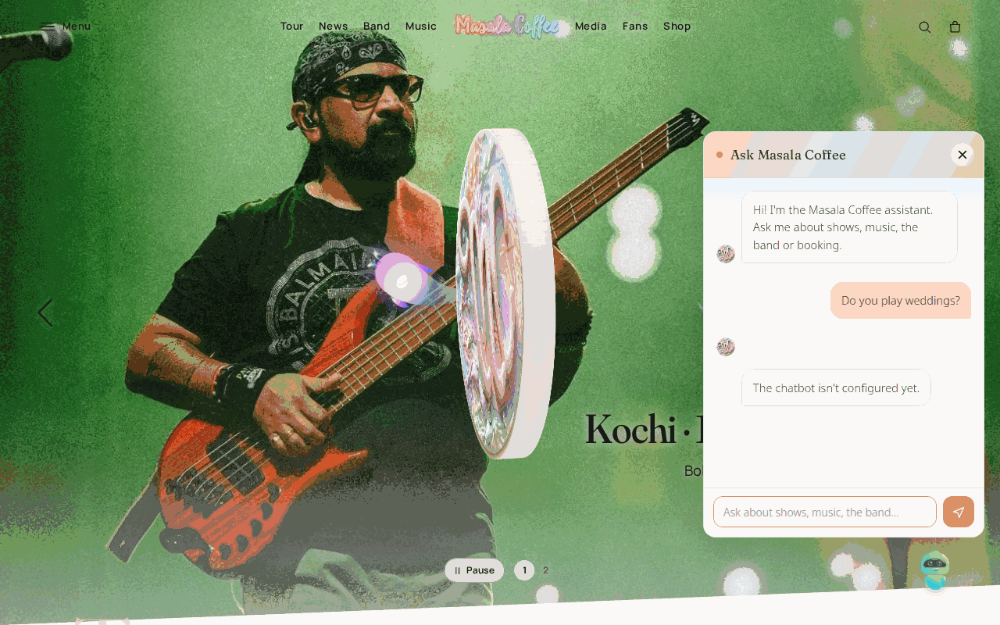

   *The chat bubble is at the bottom right of every page. On the test copy
   shown here the chatbot is switched off, so it replies "The chatbot isn't
   configured yet" — on the live website it answers using your new entry.*

#### Common mistakes

- Writing the question the way the band would say it, not the way a fan would.
  Write `Do you play weddings?`, not `Private engagement policy`.
- Expecting it instantly. The chatbot re-reads the admin panel every five
  minutes.

> **Done ✅ — check it by asking the chat bubble on any page.**

</div>

<div class="situation situation--gold" markdown="1">

### 👕 Something about the merch shop

**When to use this:** you want to change how a product reads on the website.

The shop fills itself in from the MerchGarage store every few hours. Prices,
stock, pictures and titles all come from there — anything you type into those
boxes here is wiped by the next sync. Change those in MerchGarage instead.

There are **two** boxes here that are yours to edit and that the sync never
touches:

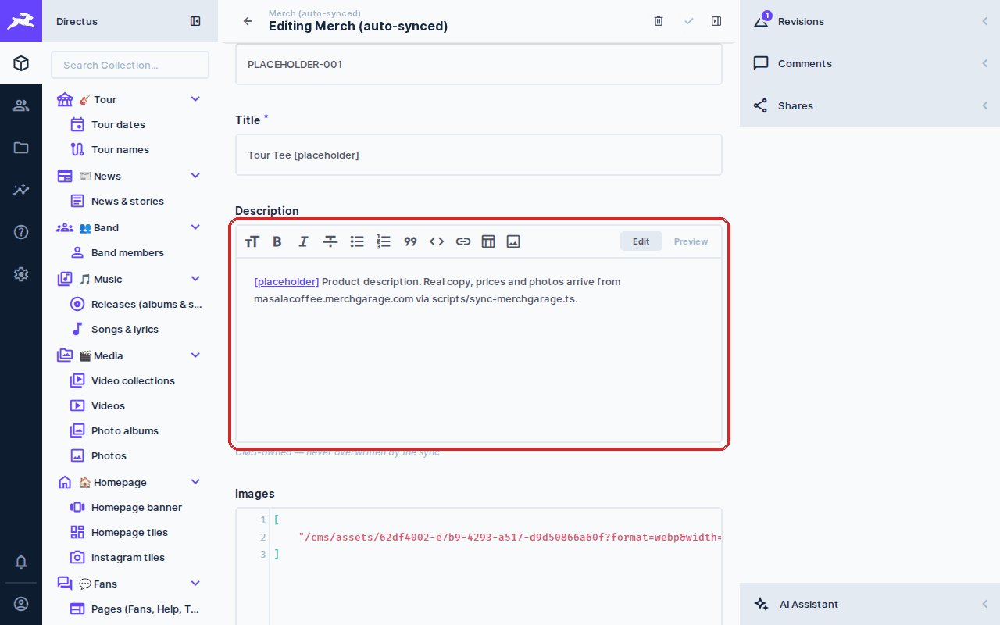

*The grey note under the box says **"CMS-owned — never overwritten by the
sync"**. That is how you know a box is safe to edit.*

- **Description** — the words on the product's page.
- **Badges** — small labels such as `New` or `Last few`.

There is also a **Featured** switch, which pushes a product higher up the shop
page.

#### Common mistakes

- Editing the price or the stock here. It will be overwritten within hours.
- Deleting a product. The next sync brings it straight back.

> **Done ✅ — check it on the website at `/shop/`.**

</div>

<div class="situation situation--sky" markdown="1">

### 📷 The Instagram wall on the homepage

**When to use this:** a new Instagram post isn't showing up yet, or you want to change which
account the wall follows.

Instagram posts appear automatically within an hour of posting — nothing to do here. If a post
is missing after that, check it's one of the newest 12 on the account (older posts scroll off the
wall on their own, they aren't deleted from Instagram). To change the connected account, ask
Shyam.

</div>

<div class="situation situation--sky" markdown="1">

### 📬 Someone signed up for the newsletter

**When to use this:** you want to see who has signed up, or send the list to
the person doing the mailout.

1. Open **Fans → Newsletter sign-ups**. Everyone who signed up is listed, with
   their email, their name if they gave one, and which page they signed up on.

   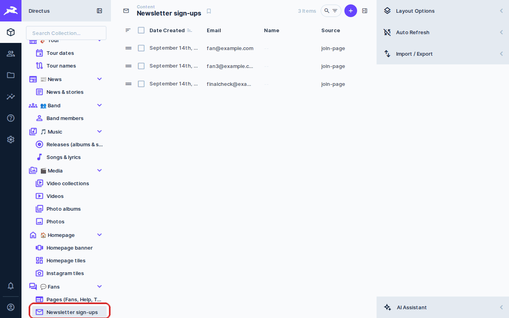

   *You can read this list, but you cannot add people to it by hand.*

2. To get it into Excel, open the panel on the right, then
   **Import / Export → Export Items**.

   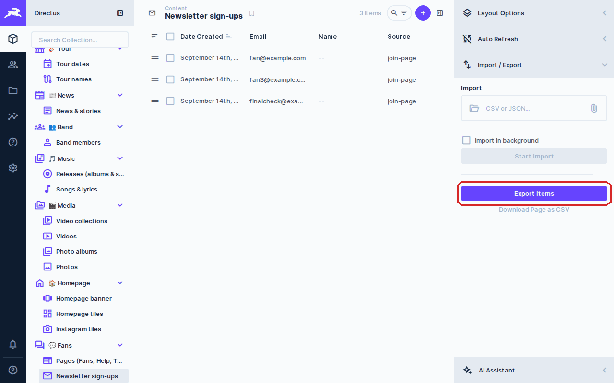

   *Click **Export Items**, choose **CSV**, and click Download. Open the
   downloaded file in Excel or Google Sheets.*

#### Common mistakes

- Emailing the raw file around. It is personal data — send it only to the
  person doing the mailout.

> **Done ✅ — the file lands in your Downloads folder.**

</div>

<div class="situation situation--peach" markdown="1">

### ⏪ Oops — I changed the wrong thing

**When to use this:** you saved something by mistake, or deleted the wrong
words, and want it back the way it was.

Every single save is kept. You can always go back.

1. Open the item you broke, and click **Revisions** in the panel on the right.

   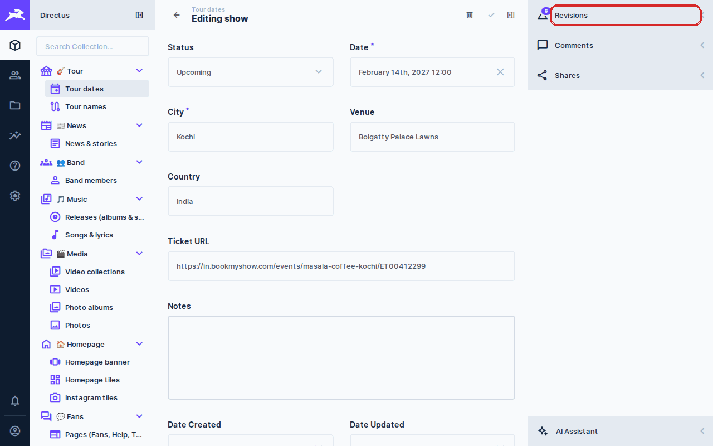

   *If the right-hand panel is closed, click the small panel icon at the top
   right to open it. **Revisions** lists every save, newest first, with who
   made it and when.*

2. Click the save you want to go back to, then click **Apply**.

   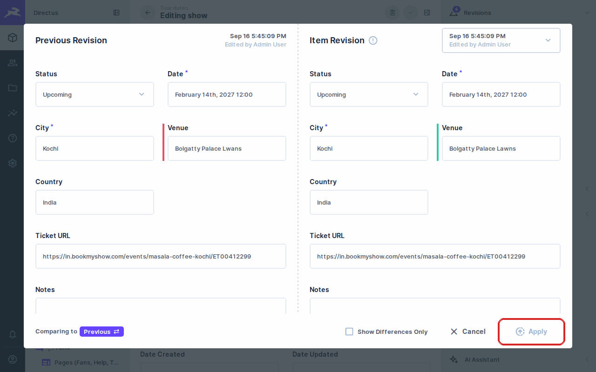

   *The old version is on the right, the current one on the left. Click
   **Apply** to put the old values back, then save with the blue tick.*

#### Common mistakes

- Panicking and re-typing everything. Check Revisions first.
- Forgetting that this does not bring back a **deleted** item — only changes
  to one that still exists. That is why the rule is: set to Draft, never
  delete.

> **Done ✅ — check the item, then the website.**

</div>

---

## 5. Picture tips

- **Format:** JPG or PNG.
- **Size:** phone photos are often 4000 pixels wide. Shrink them to about
  1600–2000 pixels wide before uploading. Big files make the site slow.
- **Homepage banner:** the picture **must be wider than it is tall**.
  1920 × 1080 is ideal. Keep faces away from the very edges.
- **Show posters:** tall, like a real gig poster.
- **News and release covers:** square or slightly wide. About 1200 × 800.
- **Member photos:** square or tall, centred on the face.

## 6. Troubleshooting

**My change is not showing on the website.**

1. Is **Status** set to `Published`? Draft and Archived are invisible.
2. Did you click the blue tick (✓)?
3. Hard-refresh the page: **Ctrl+Shift+R** (Windows and Linux) or
   **Cmd+Shift+R** (Mac).
4. Give it a minute. The chatbot can take five.

**My new show is not on the Tour page.**

Check **Status** is set to `Upcoming` — the **Web address** box fills itself
in automatically, so that is not usually the problem.

**My picture looks cropped or squashed.**

The website crops pictures to fit a fixed shape. Check the shape against
[Picture tips](#5-picture-tips) — a tall picture in a wide slot always loses
its top and bottom.

**The chatbot does not know something.**

Add it to [FAQ & chatbot answers](#-the-chatbot-got-something-wrong). The
chatbot only knows what is in the admin panel.

**I broke something.**

Use [Revisions](#-oops--i-changed-the-wrong-thing).

**Still stuck?** Contact Shyam — especially for Site settings, the Pages
blocks, or anything that is not in this guide.

## 7. Words we use

| Word | What it means |
| --- | --- |
| **CMS / admin panel** | The screen where you change the website. |
| **Collection** | A type of content in the sidebar: Tour dates, News & stories, Band members… |
| **Item** | One entry: one show, one post, one member. |
| **Field** | One box you fill in: Title, Date, Status. |
| **Save** | The blue tick (✓) at the top right. |
| **Status** | Whether something is live. See below. |
| **Web address / slug** | The end of the page's address. See below. |
| **File Library** | The store of every picture that has been uploaded. |
| **Revisions** | The history of saves, and how you undo a mistake. |

### What "Status" looks like


*`Draft` — saved, but nobody can see it.*


*`Published` — live on the website.*

### What a "web address" looks like

It fills itself in automatically — small letters, hyphens instead of spaces,
no punctuation. A show on 14 February 2027 in Kochi, Kerala becomes
`2027-02-14-kochi-kerala`, making the page `/tour/2027-02-14-kochi-kerala/`.
You never need to type it; you can still edit it afterwards if you ever need
to override it.

## 8. Cheat sheet

Print this page and stick it on the wall.

| I want to… | Go to | Then |
| --- | --- | --- |
| Add a show | Tour → Tour dates | Blue **+**, fill in, blue tick (Web address fills itself in) |
| Say a show is sold out | Tour → Tour dates | Click the show → **Status** → `Sold out` → blue tick |
| Move an old show out of the way | Tour → Tour dates | Click the show → **Status** → `Past` → blue tick |
| Put up photos | Media → Photo albums | Blue **+**, fill in, **Show Slug**, Photos → Create New, blue tick |
| Add a song | Music → Songs & lyrics | Blue **+**, title + written by, `Published`, blue tick |
| Add a release | Music → Releases | Blue **+**, cover + links, Tracks → Add Existing, blue tick |
| Add a song to the site player | Music → Tracks (audio for the site player) | Blue **+**, Title + **Audio file** (MP3/M4A), `Published`, blue tick |
| Add a video | Media → Videos | Blue **+**, paste **just the ID**, pick the collection, blue tick |
| Write a news post | News → News & stories | Blue **+**, `Draft` while writing, `Published` when ready |
| Change the homepage banner | Homepage → Homepage banner | Click it → **Button text** / **Button link** → blue tick |
| Fix a member's photo or role | Band → Band members | Click them → change → blue tick |
| Fix the band description | Settings → Site settings | Edit **Tagline** → blue tick (**ask the band first**) |
| Teach the chatbot something | Fans → FAQ & chatbot answers | Blue **+**, question + answer, blue tick |
| Change a product's words | Shop → Merch | Click it → **Description** or **Badges** only → blue tick |
| Get the newsletter list | Fans → Newsletter sign-ups | Right panel → Import / Export → Export Items → CSV |
| Undo a mistake | Any item | Right panel → **Revisions** → pick a save → **Apply** |
