# Masala Coffee website — user guide

This guide is for the band and management — no coding needed. It explains
how to update the website yourself through the admin panel (the "CMS").

## Table of contents

1. [What you can change, and where](#1-what-you-can-change-and-where)
2. [Logging in](#2-logging-in)
3. [Golden rules](#3-golden-rules)
4. [Task recipes](#4-task-recipes)
   - [Add an upcoming show](#add-an-upcoming-show)
   - [Mark a show sold out / past](#mark-a-show-sold-out--past)
   - [Add a news post](#add-a-news-post)
   - [Add a release with tracks](#add-a-release-with-tracks)
   - [Add a video or a new video set](#add-a-video-or-a-new-video-set)
   - [Add photos to a gallery / create a gallery](#add-photos-to-a-gallery--create-a-gallery)
   - [Update members and the band bio](#update-members-and-the-band-bio)
   - [Change the hero slides](#change-the-hero-slides)
   - [Edit the FAQ and the chatbot's personality](#edit-the-faq-and-the-chatbots-personality)
   - [Add a promo tile](#add-a-promo-tile)
   - [Fan stories / club news](#fan-stories--club-news)
   - [Edit help / terms pages](#edit-help--terms-pages)
   - [Subscribers](#subscribers)
   - [Merch](#merch)
   - [Social links](#social-links)
5. [Picture tips](#5-picture-tips)
6. [Troubleshooting](#6-troubleshooting)
7. [Glossary](#7-glossary)

---

## 1. What you can change, and where

The website has an admin panel at **`<website>/cms/admin/`** — replace
`<website>` with whatever the site's address is at the time (it may move
between servers; the admin panel address always ends in `/cms/admin/`).

| Website page | Where to edit it |
|---|---|
| Tour dates | **Shows** |
| News, Press, Features | **Posts** |
| Band members, History | **Members**, **Site Settings** |
| Releases, Songs & lyrics | **Releases**, **Songs** |
| Videos | **Video Sets** and **Videos** |
| Photos | **Galleries** and **Photos** |
| Homepage banner | **Hero Slides** |
| Fans, stories, club news | **Posts** (categories) and **Pages** |
| Shop | **Products** (mostly automatic — see [Merch](#merch)) |
| FAQ / chatbot | **FAQ** and **Site Settings** |
| Help, Terms, Privacy pages | **Pages** |
| Newsletter sign-ups | **Subscribers** |

The left-hand list is the **sidebar**. Each entry is a "collection" — a
type of content. Click one to see a list of items; click an item to edit
it, or the **+** button (top right) to add a new one.

## 2. Logging in

1. Go to `<website>/cms/admin/`.
2. Enter your email and password and click **Sign In**. Your login email
   and password will be shared by Shyam.

- **Forgot your password?** Click **Forgot Password** on this screen and
  follow the email that arrives.
- **Changing your password:** click your account icon at the bottom of the
  sidebar → **Admin Options** → you can set a new password there.
- **The layout:** the far-left strip is quick icons (notifications,
  account). Next to it is the **sidebar** listing every type of content.
  The middle is the list or the item you're editing. The right-hand panel
  (when open) shows **Revisions**, **Comments** and other extras for the
  item you're editing.

## 3. Golden rules

- **Save after every edit.** Nothing is kept until you click the checkmark
  (✓) **Save** button, top right of the screen. If you navigate away
  without saving, your change is lost.
- **Draft vs Published.** Many items have a **status** field:
  - **Published** — visible on the live website.
  - **Draft** — saved, but hidden from visitors. Use this while you're
    still working on something.
  - Some collections also have **Archived** — hidden, but kept for later
    (shows use `past` for old shows instead).
- **Pictures appear within a minute.** After you upload and save, give the
  site up to a minute to show it (the chatbot can take up to 5 minutes to
  notice CMS changes).
- **Don't delete — unpublish.** If you're not sure, set an item to Draft
  instead of deleting it. Deleting is permanent.
- **Ask before changing Site Settings.** This one screen affects the whole
  site (band name, tagline, social links, chatbot personality) — check
  with the rest of the band first.

## 4. Task recipes

### Add an upcoming show

1. Click **Shows** in the sidebar, then the **+** button.
2. Fill in the fields:
   - **Status** — set to `Upcoming`.
   - **Date** — the show's date (and time).
   - **City**, **State Region**, **Country** — where it is.
   - **Venue** — the venue name (leave as "Venue to be announced" if unknown yet).
   - **Ticket URL** — link to buy tickets. Leave blank if there isn't one yet.
   - **Notes** — anything extra, e.g. support act or age restriction.
   - **Poster Image** — click the empty box, then **Upload File** (or drag
     a picture in). See [Picture tips](#5-picture-tips) for sizing.
   - **Tour** — pick the tour this show belongs to, if there is one.
   - **Other Acts** — supporting acts, if any.
   - **Status Lines** — the buttons shown on the show page (e.g. "Tickets",
     "Enhanced experience"). This is a small code box; each line needs
     a **label** (button text), a **state** (`available`, `unavailable`, or
     `info`), and a **url**. Ask Shyam if you're not comfortable editing
     this directly — copy an existing show's Status Lines as a starting
     point and just change the words.
   - **Gallery** — link to a photo gallery for this show, if one exists.
   - **Setlist** — scroll further down to add songs, in order, from the
     song catalogue. Click **Add Existing** to pick songs already in the
     system, or **Create New** to add a brand-new song first.
3. Click **Save** (✓, top right).

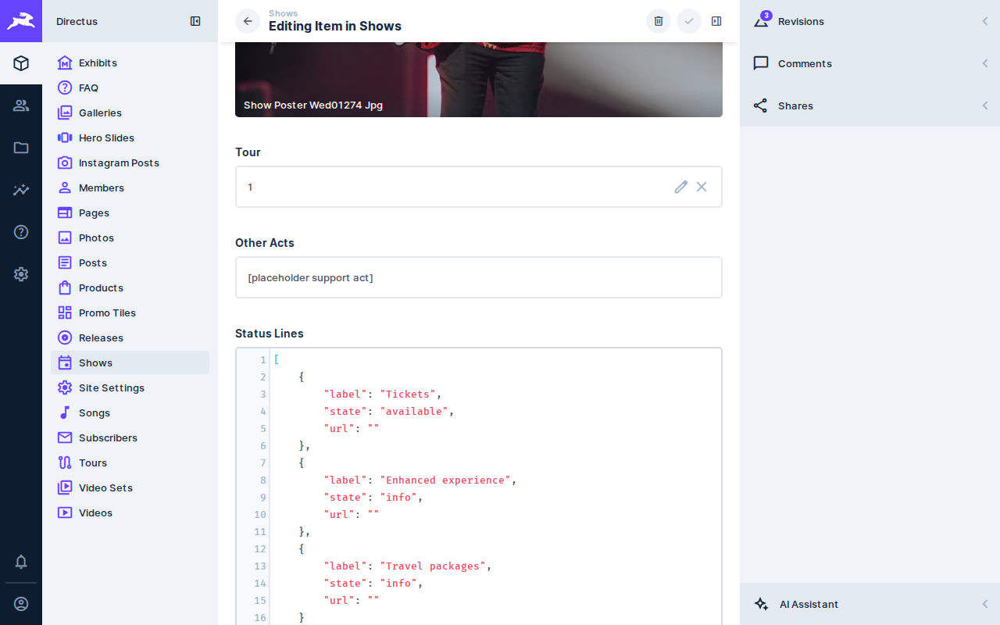
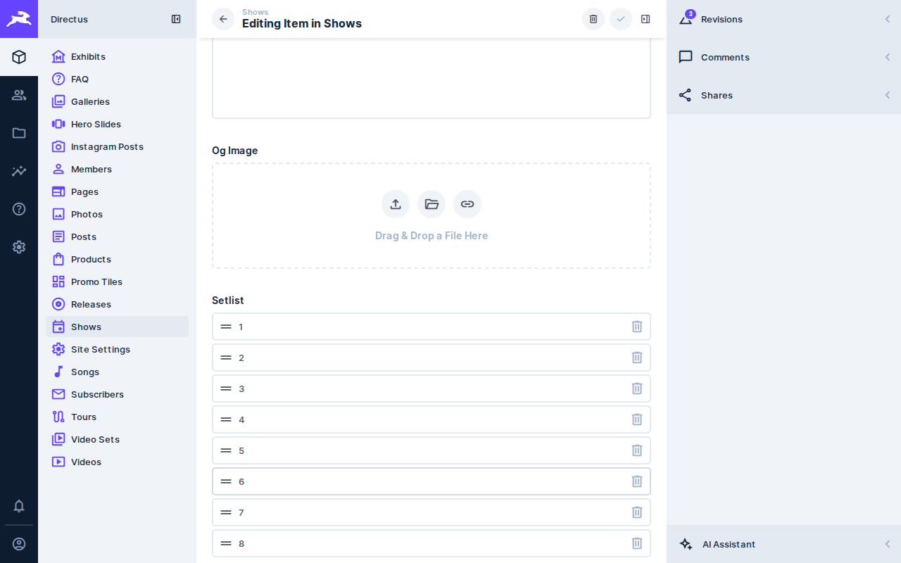

### Mark a show sold out / past

1. Click **Shows**, then click the show.
2. Change **Status**:
   - `Sold out` — shows a "Sold out" tag; the ticket link is hidden.
   - `Past` — moves it out of the upcoming list; the chatbot and Tour page
     stop treating it as upcoming.
3. Update **Status Lines** to match (e.g. change the "Tickets" label to
   "Sold out" with state `unavailable`).
4. Click **Save**.

### Add a news post

1. Click **Posts** → **+**.
2. Fill in:
   - **Title** — the headline.
   - **Slug** — the web address, e.g. `our-first-tour` becomes
     `/news/our-first-tour`. Lowercase words separated by hyphens, no spaces.
   - **Date** — publish date (also used for ordering).
   - **Cover** — click to upload a picture for the post.
   - **Excerpt** — a one or two sentence summary, shown in post lists.
   - **Category** — `news`, `press`, `features`, `fan-stories` or
     `club-news`.
   - **Body** — the article text, written in **Markdown**:

     | Want this | Type this |
     |---|---|
     | **Bold** | `**bold**` |
     | *Italic* | `*italic*` |
     | Heading | `## Heading` |
     | Link | `[link text](https://example.com)` |
     | Picture inline | `` |
     | YouTube video | paste the plain YouTube link on its own line, e.g. `https://www.youtube.com/watch?v=dQw4w9WgXcQ` |

   - **Status** — `Draft` while writing, `Published` when it should go live.
3. Click **Save**.

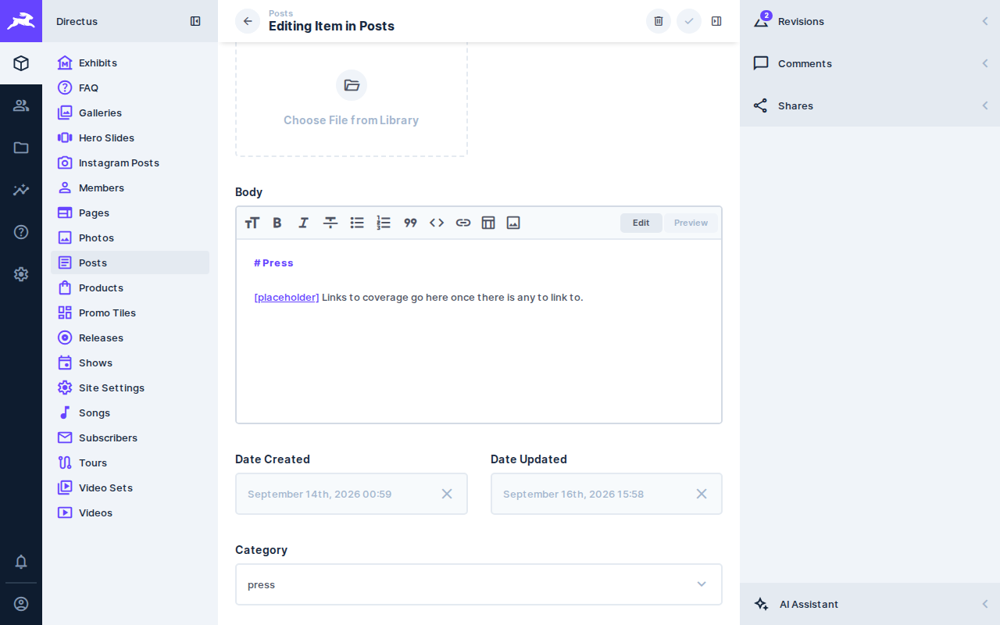

### Add a release with tracks

1. If the songs aren't in the system yet, add them first: click
   **Songs** → **+**, fill in **Title** (and optionally **Written by**,
   **Lyrics**, **First performed**), set **Status** to `published`, and
   **Save**.
2. Click **Releases** → **+**.
3. Fill in **Title**, **Type** (album/single/EP/compilation), **Release
   Date**, **Category**, **Cover** picture, and any of **Spotify URL**,
   **Apple URL**, **YouTube URL**, **Description**.
4. Scroll down to **Tracks**. Click **Add Existing** to pick songs you
   already added, or **Create New** to add one on the spot. Drag rows to
   reorder the tracklist.
5. Set **Status** to `published` when ready, and **Save**.

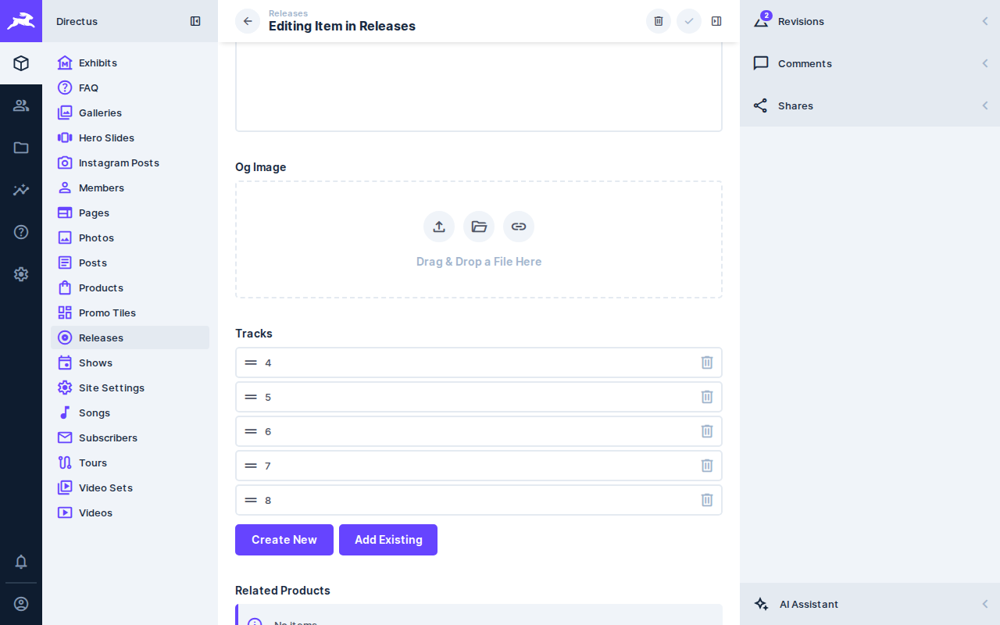

### Add a video or a new video set

1. Videos are grouped into **Video Sets** (these become pages like
   `/videos/official-music-videos/`). Click **Video Sets** to see the
   existing ones, or **+** to make a new one (fill in **Title**,
   **Category**, **Status**).
2. Open a video set and scroll to **Videos** → **Create New** (or click
   **Videos** in the sidebar directly → **+**).
3. Fill in:
   - **Title** — how it's labelled.
   - **YouTube ID** — NOT the whole link, just the short code at the end.
     In `https://www.youtube.com/watch?v=dQw4w9WgXcQ` the ID is the part
     after `v=`: `dQw4w9WgXcQ`. In `https://youtu.be/dQw4w9WgXcQ` it's the
     part after the slash — same ID either way.
   - **Published Date** — optional, for ordering.
   - **Video Set** — which set it belongs to.
4. Click **Save**.

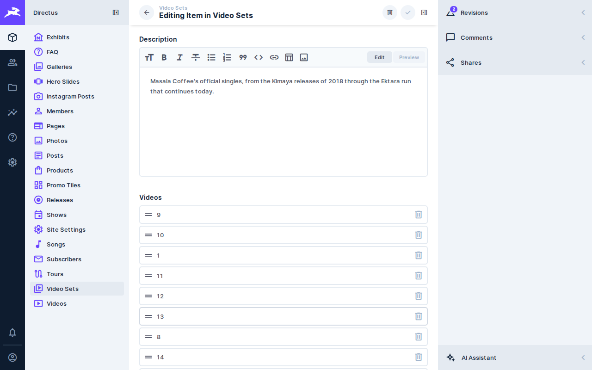

### Add photos to a gallery / create a gallery

1. Click **Galleries** → **+** for a new gallery, or click an existing one.
2. Fill in **Title**, **Category**, **Date**, **Location**, and a **Cover**
   picture. If this gallery belongs to a specific show, fill in
   **Show Slug** with that show's slug.
3. Scroll to **Photos** → **Add Existing** (pick uploaded photos) or
   **Create New** (upload a new one and caption it on the spot). Drag to
   reorder.
4. Set **Status** to `published` and **Save**.

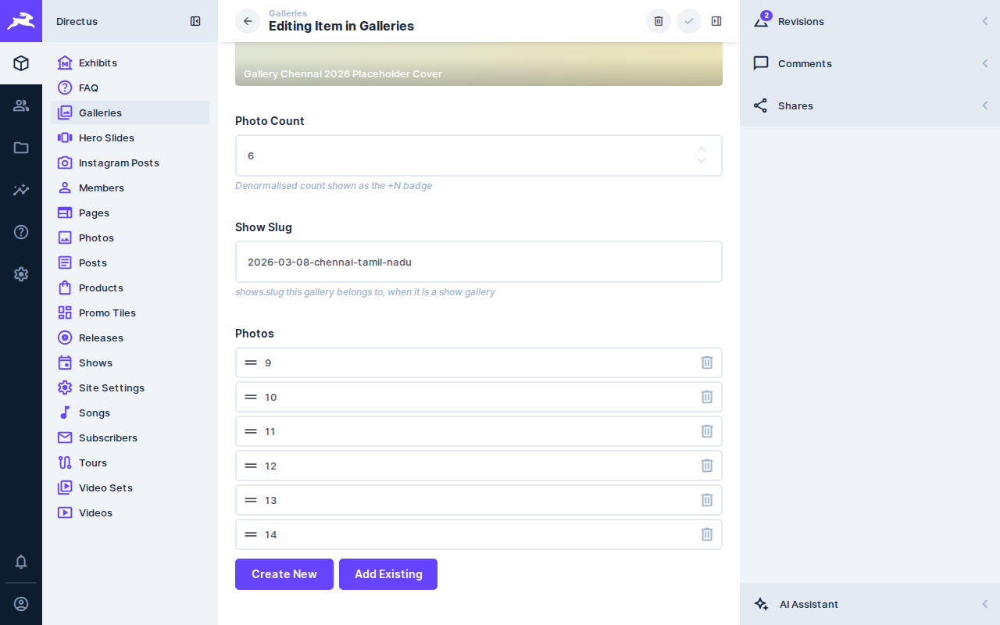

### Update members and the band bio

- **Members**: click **Members**, then a member (or **+** for a new one).
  Fill in **Name**, **Role** (e.g. "Percussion · Founder"), **Bio**, a
  **Photo**, and **Sort** (lower number = appears first). Set **Status** to
  `published`.
- **Band name / tagline**: click **Site Settings** (this is a single screen,
  not a list). **Band Name** and **Tagline** appear across the site header
  and the chatbot's introduction.

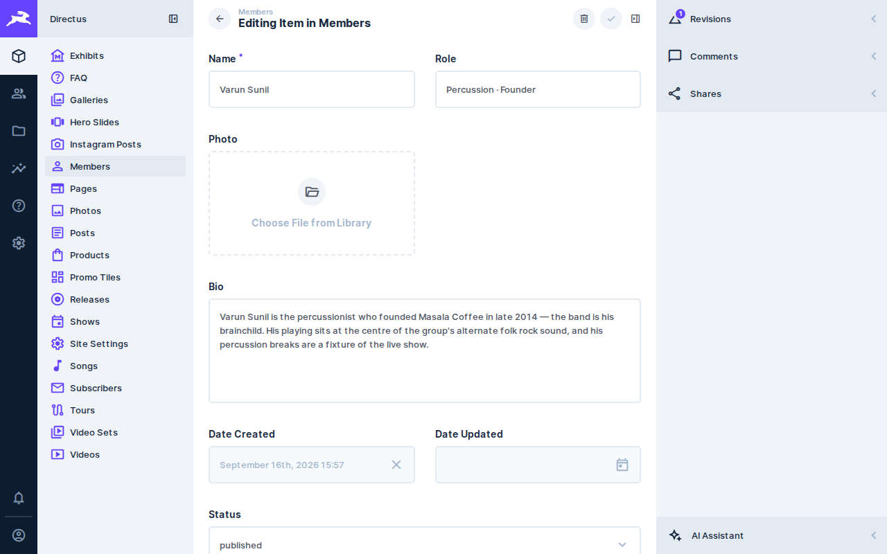

### Change the hero slides

The hero slides are the big rotating banner on the homepage.

1. Click **Hero Slides**.
2. Click a slide, or **+** for a new one.
3. Fill in:
   - **Image** — recommended size **1920×1080 pixels** (a wide, landscape
     shape) so it fills the banner cleanly on phones and desktops. Keep
     important text or faces away from the very edges.
   - **Title** / **Subtitle** — the text overlaid on the image.
   - **CTA Label** / **CTA Url** — the button's text and where it links to
     (e.g. "Get tickets" → the tour page). Leave both blank for no button.
   - **Sort** — order in the carousel (lower number shows first).
   - **Status** — only `published` slides actually show. Use `draft` to
     prepare one ahead of time, `archived` to retire an old one without
     deleting it.
4. Click **Save**.

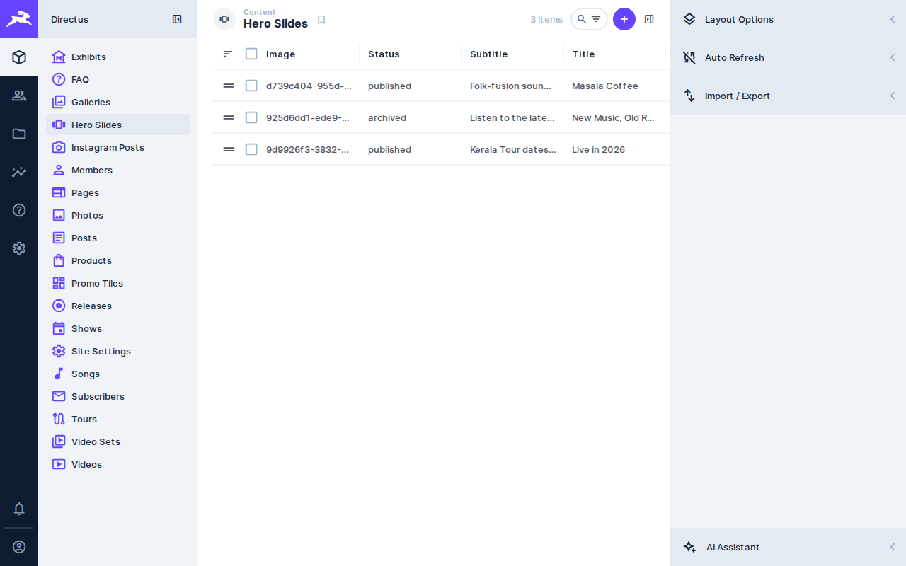

### Edit the FAQ and the chatbot's personality

There's a chat bubble on every page of the site. **It only knows what's in
this CMS — nothing more, nothing made up.**

- **FAQ collection**: the best place to "teach" the chatbot things that
  don't fit anywhere else — booking policy, genre, merch availability,
  anything fans commonly ask. Click **FAQ** → **+**, fill in a **Question**
  and **Answer**. The chatbot uses this text when it's relevant. If it
  doesn't know something, it says so rather than guessing — so if fans keep
  asking something it gets wrong, add an FAQ entry for it.
- **Site Settings → Chatbot Persona**: sets the chatbot's tone (e.g. "You
  are warm, a little playful, and proud of the band's Kerala roots"). Leave
  it blank for a sensible default.

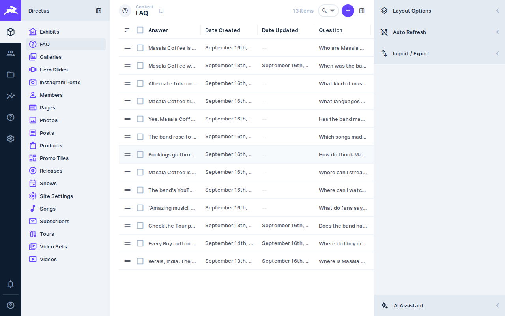
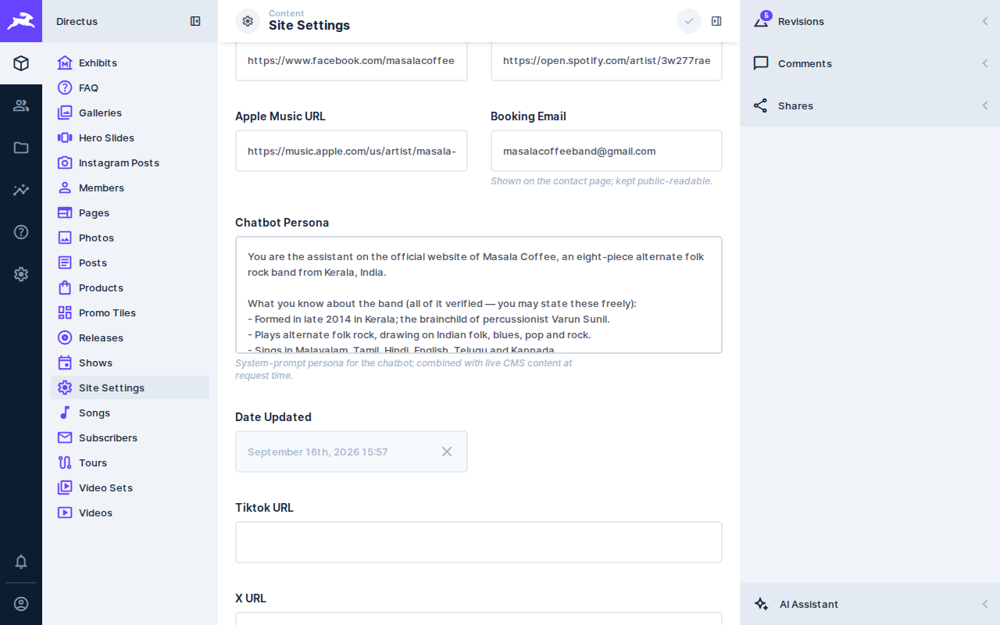

### Add a promo tile

Promo tiles are small image-and-link cards used on the homepage and other
landing spots. Click **Promo Tiles** → **+**, fill in **Placement** (where
it appears), **Title**, **Subtitle**, an **Image**, and **CTA Label** +
**Href** (what it links to). Set **Status** to `published` and **Save**.

### Fan stories / club news

These are just **Posts** with a specific **Category**:

- `fan-stories` for stories from fans.
- `club-news` for news aimed at the fan club.

Follow the [Add a news post](#add-a-news-post) steps above and pick the
right category — they'll automatically appear in the right place on the
Fans page.

### Edit help / terms pages

Help, Terms, Privacy, Credits, Archive and Fans are all **Pages** — built
from a list of content blocks rather than one big text box.

1. Click **Pages**, then the page you want (e.g. **help**).
2. Most of these pages use a simple text block. Look for a block of type
   `rich_text` inside the **Sections** field and edit its `body` text
   (Markdown — same cheatsheet as [news posts](#add-a-news-post)).
3. This field is shown as raw code (JSON). If you're not comfortable
   editing it directly, ask Shyam — a small mistake here can make the block
   disappear from the page (it fails safely, so nothing breaks, but your
   change won't show).
4. Click **Save**.

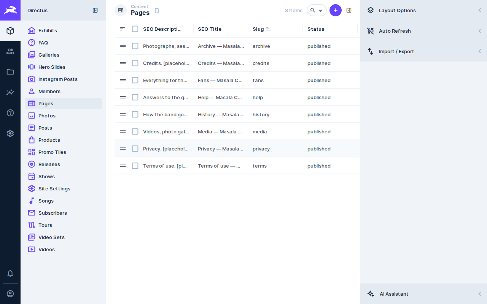

### Subscribers

Click **Subscribers** to see everyone who signed up for the newsletter
(their email, name if given, and where they signed up). You can't add
subscribers here — only view them.

**To export the list:** open **Subscribers**, click the filter/list icon
(top right, next to search) → **Import / Export** → **Export Items** →
choose **CSV** → **Download**. Open the downloaded file in Excel or Google
Sheets.

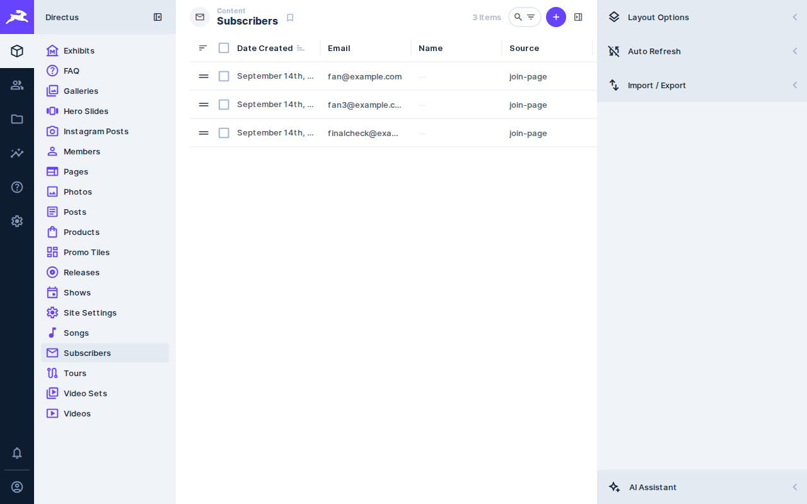

### Merch

Click **Products** to see the shop items. These are **synced automatically**
from the MerchGarage store every few hours — price, stock, images and
titles update on their own. You do **not** need to (and can't usefully)
edit most fields here.

What you *can* edit by hand:

- **Description** — shown on the product's page on the site.
- **Badges** — small labels like "New" (a short list of words).
- **Featured** — tick to feature it more prominently.

Everything else (price, stock, images, title) will simply be overwritten
by the next sync — edit those in the MerchGarage store itself instead.

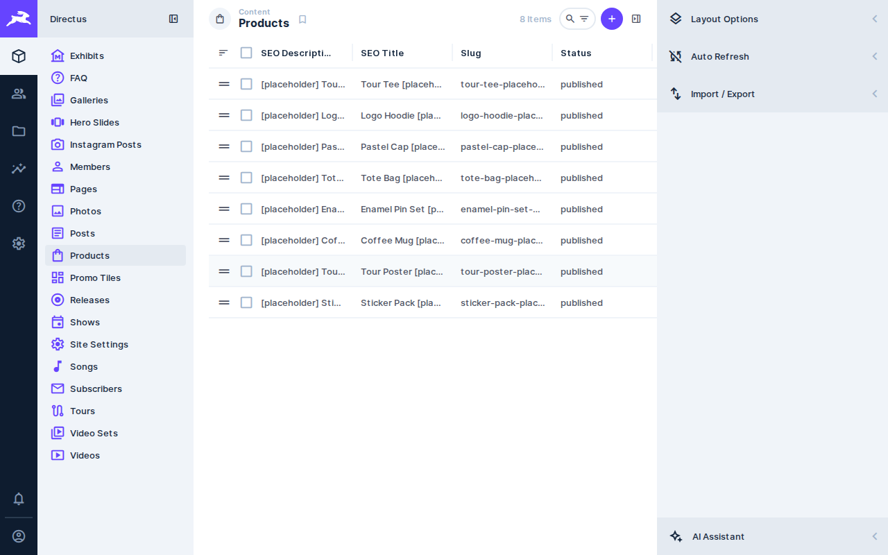

### Social links

Click **Site Settings** and scroll through the URL fields: **Instagram
URL**, **YouTube URL**, **Facebook URL**, **Spotify URL**, **Apple Music
URL**, **TikTok URL**, **X URL**, **Discord URL**, **Merch URL**, **Booking
Email**. Update any of these and **Save** — they're used across the site
header, footer and the chatbot.

## 5. Picture tips

- **Format**: JPG or PNG.
- **File size**: keep under a few MB. Phone photos are often 4000px+ wide —
  resize to around 1600–2000px wide before uploading; large files slow the
  site down.
- **Hero slides**: landscape, ~1920×1080 (16:9).
- **Show posters**: portrait works well, similar to a gig poster.
- **Post / release covers**: square or landscape both work, roughly
  1000×1000 or 1200×800.
- **Member photos**: portrait or square, centred on the face.

## 6. Troubleshooting

**My change isn't showing on the site.**

- Hard refresh the page (Ctrl+Shift+R on Windows/Linux, Cmd+Shift+R on
  Mac) — your browser may be showing an old cached copy.
- Check the item's **Status** is `published`, not `draft` or `archived`.
- Give it a minute — some pages cache briefly. The chatbot can take up to
  5 minutes to notice a change.

**My image looks cropped or squished.**

- Check its dimensions against the [picture tips](#5-picture-tips) above —
  most banners and cards crop to a fixed shape, so a very different shape
  original will be cropped to fit.

**I deleted or changed something by mistake.**

- Open the item, then open the **Revisions** panel on the right (click
  **Revisions** in the sidebar that appears while editing an item). Every
  save is listed with who made it and when — click an entry to see what
  changed, and you can revert to it.

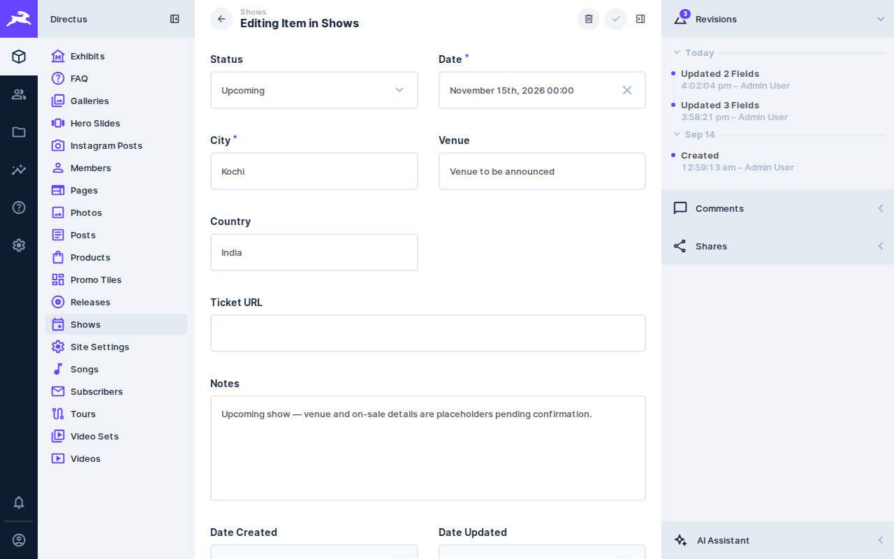

**Who to contact:** if you're stuck, or need something changed that isn't
covered here (Site Settings, a tricky Pages block, a new collection),
contact Shyam.

## 7. Glossary

| Term | Meaning |
|---|---|
| CMS | "Content Management System" — the admin panel where you edit the website's content. |
| Collection | A type of content in the sidebar (Shows, Posts, Members, …). |
| Item | One entry inside a collection (one show, one post, …). |
| Field | One box you fill in on an item (Title, Date, Status, …). |
| Status | Whether an item is `draft` (hidden), `published` (live), or `archived`/`past` (retired). |
| Slug | The web-address-friendly version of a title, e.g. `our-first-tour`. |
| Markdown | Plain-text formatting (`**bold**`, `## heading`, etc.) used in text bodies. |
| M2M / tracklist / setlist / photos field | A list that links to other items (e.g. a release's tracks, a show's setlist, a gallery's photos) — add rows with **Add Existing** or **Create New**. |
| Revisions | The history of saves for an item, and a way to undo a mistake. |

---

© Masala Coffee / Quantum Automata
